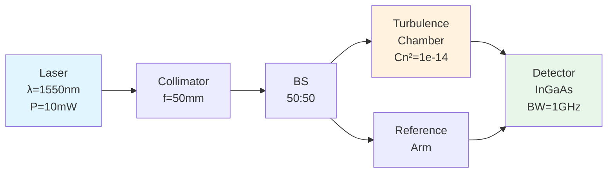
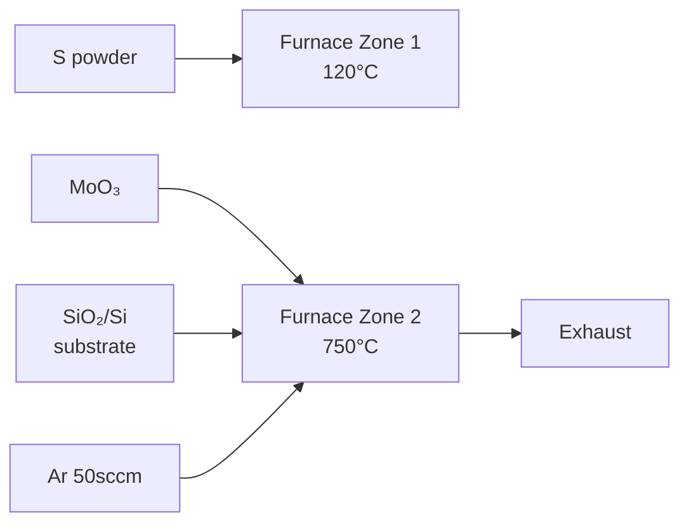

# PRD: Sasoo (사수) — Your AI Co-Scientist for Deep Research Analysis

> **Version**: 3.0
> **Date**: 2026-02-07
> **Author**: DJ
> **Status**: Draft
> **Changelog**: v2.0 → v3.0 — 웹 서비스 → Electron 데스크톱 앱 피봇, 인프라 대폭 간소화(K8s/Docker/Redis/PostgreSQL 제거), Gemini 3.0 + Claude Sonnet 4.5 듀얼 LLM, Visualization Router(Mermaid vs PaperBanana 자동 라우팅), Progressive Loading UX, 단계별 섹션 전달 비용 최적화, PaperBanana 패키지 연동, 4단계 공학적 분석 전략(Screening → Visual → Recipe → Deep Dive) 도입

---

## 1. Executive Summary

### 1.1 Product Identity

| 항목 | 내용 |
|------|------|
| **Product Name** | Sasoo (사수) |
| **Tagline** | *Your AI Co-Scientist — 논문을 읽어주는 박사 사수* |
| **Core Philosophy** | 단순 요약(Summarization)이 아닌, 공학 연구자의 **실제 논문 읽기 방식**(숲 → 나무 → 내 것)을 재현하는 AI 연구 파트너. Figure-First, Recipe Card, Reproducibility Check를 통해 **"내일 바로 실험할 수 있는 수준"**의 분석을 제공한다. |

### 1.2 Product Vision

Sasoo는 PDF 논문을 업로드하면 **Gemini 3.0 + Claude Sonnet 4.5 듀얼 LLM** 기반 **도메인 특화 AI 에이전트**가 4단계 공학적 분석 전략으로 논문을 읽고, 핵심 파라미터를 **실험 레시피 카드**로 정리하며, **Visualization Router**가 시각화 대상을 자동 분류하여 **Mermaid.js(논리 다이어그램, Sonnet 4.5) + PaperBanana(출판 수준 삽화, Gemini Pro Image)** 이중 시각화를 생성하고, **Progressive Loading UX**로 텍스트 먼저 표시 후 다이어그램/이미지를 비동기 삽입하여 **통합 Markdown 보고서**로 저장하는 **로컬 데스크톱 AI Co-Scientist**이다.

### 1.3 v2.0 → v3.0 핵심 피봇

| 영역 | v2.0 | v3.0 | 피봇 사유 |
|------|------|------|----------|
| 실행 환경 | 웹 서비스 (K8s + Docker) | **Electron + React** 데스크톱 앱 | 10명 사용자에 K8s는 과잉. 연구자는 로컬에서 논문을 읽음 |
| 인프라 | PostgreSQL + ChromaDB + Redis + S3 | **SQLite 단독** | 데이터 저장소 4개 → 1개로 간소화 |
| LLM | Claude + GPT-4o + Gemini + Ollama (4종) | **Gemini 3.0 (분석) + Claude Sonnet 4.5 (Mermaid)** 듀얼 | Mermaid 생성은 Sonnet 4.5 품질이 높음. 분석은 Gemini 단독 |
| 비용 | 전체 텍스트 LLM 투입 | **단계별 섹션 전달** (토큰 70-80% 절감) | 전체 투입은 비용 과다 |
| RAG | Section-based RAG + Hybrid Search + Vector DB | **RAG 없음** (섹션 분할만) | 로컬 앱에 Vector DB는 과잉 |
| 시각화 | Mermaid + NanoBanana (자체 구현) | **Mermaid + PaperBanana** (`pip install`) | 검증된 오픈소스 패키지 활용 |
| 분석 전략 | 범용 CoT | **4단계 공학적 분석** | 실제 연구자 워크플로우 반영 |
| 출력 | Split View 대시보드 (양방향 링크) | **단순 병렬 (PDF + Markdown)** | 양방향 링크 구현 난이도 대비 효용 낮음 |
| 배포 | Docker + K8s + SSO + Celery | **전부 제거** | 로컬 앱에 불필요 |

---

## 2. Problem Statement

### 2.1 현재 상태 (As-Is)

| 항목 | 현재 |
|------|------|
| 논문 분석 방식 | 수동 PDF 읽기 → 수기 정리 (Word/Excel/노트) |
| 분석 깊이 | 요약(Summary) 수준, 비판적 검증 부재 |
| 도메인 전문성 | 범용 LLM 분석, 분야별 사고방식 미반영 |
| Method 재현 | 논문에서 누락된 세부사항을 별도 검색·추정으로 보완 |
| 파라미터 정리 | 표/그래프에서 수동 추출, 출처 추적 어려움 |
| Figure 활용 | 논문 속 Figure를 별도 캡처·저장해야 함 |
| 논문 관리 | 폴더 기반 수동 관리, 분석 이력 산재 |

### 2.2 핵심 문제점

- 논문 1편 분석에 평균 **2~4시간** 소요
- Figure/Table을 먼저 보고 데이터 품질을 판단하는 **공학적 읽기 습관**을 도구가 지원하지 않음
- Method의 빠진 파라미터(implicit assumptions)를 놓치기 쉬움
- AI 분석 결과가 원문 근거와 분리되어 hallucination 검증이 어려움
- 분석 결과물(Figure, Table, 파라미터)이 체계적으로 저장되지 않음

### 2.3 목표 상태 (To-Be)

| 항목 | 목표 |
|------|------|
| 논문 분석 방식 | PDF 업로드 → 도메인 자동 분류 → **4단계 공학적 분석** → 통합 Markdown 보고서 |
| 분석 깊이 | Figure-First 검증 + Recipe Card + Reproducibility Check |
| 도메인 전문성 | 분야별 에이전트 (Phase 1: Optics) |
| Method 재현 | 빠진 파라미터 자동 식별 + `[INFERRED]` 태그 경고 |
| 파라미터 정리 | 자동 추출 → **실험 레시피 카드 (Table)** |
| Figure 활용 | **Figure 모아보기** + AI 해석 + 로컬 저장 |
| 결과 저장 | 앱 전용 디렉토리에 체계적 저장 (Markdown + Figure + Mermaid + PaperBanana) |

---

## 3. Target Users

| 사용자 유형 | 설명 | 규모 |
|-------------|------|------|
| Primary | 대학원 석사과정, 박사과정 1년차 (Optics 우선, 이후 Bio/AI/EE 확장) | 10명+ |
| Secondary | 새로운 분야에 transfer하는 연구원 | 3~5명 |

---

## 4. 핵심 분석 전략 — 4단계 공학적 읽기

Sasoo의 분석은 연구자의 **실제 논문 읽기 습관**을 재현한다:
**"숲을 먼저 보고(Scanning) → 나무를 파고(Digging) → 내 것으로 만드는(Synthesizing)"**

### 4.1 분석 플로우 개요

```
PDF Upload
  │
  ▼
┌─────────────────────────────────────────────────┐
│  Phase 1: Screening (간보기)                      │
│  입력: Abstract + Conclusion 만 전달              │
│  모델: Gemini 3.0 Flash (저비용)                  │
│  질문: "이 논문이 내 연구와 관련 있는가?"          │
│  출력: 관련성 판단 + 키워드 + 읽을 가치 점수       │
│  사수: "제목이랑 초록만 봐. 키워드 없으면 버려."    │
└──────────────────────┬──────────────────────────┘
                       │ 관련 있음 → 계속
                       ▼
┌─────────────────────────────────────────────────┐
│  Phase 2: Visual Verification (데이터 검증)        │
│  입력: Figures + Captions 만 전달 (이미지 포함)    │
│  모델: Gemini 3.0 Flash (멀티모달)                │
│  핵심: "본문보다 그림을 먼저 봐라"                 │
│  출력: Figure 해석 + Data Quality 평가             │
│  사수: "Log 스케일로 눈속임했는지 확인해."          │
└──────────────────────┬──────────────────────────┘
                       ▼
┌─────────────────────────────────────────────────┐
│  Phase 3: Recipe Extraction (핵심 채굴)            │
│  입력: Experimental / Method 섹션 만 전달          │
│  모델: Gemini 3.0 Pro (고품질 추출)               │
│  핵심: "돈이 되는 정보. 실험 따라하려면 필수"       │
│  출력: 실험 레시피 카드 (파라미터 테이블)           │
│       + 누락 파라미터 경고 [INFERRED]              │
│  사수: "Room Temperature 믿지 마. 습도 영향도 봐."  │
└──────────────────────┬──────────────────────────┘
                       ▼
┌─────────────────────────────────────────────────┐
│  Phase 4: Deep Dive (논리 파악)                    │
│  입력: Introduction + Results & Discussion 전달    │
│  모델: Gemini 3.0 Pro (비판적 분석)               │
│  핵심: "왜 이 방법? 기존 대비 얼마나 우수?"        │
│  출력: 연구 동기 + Prior Work 비교 + 비판적 분석   │
│       + Limitation + Future Work                   │
│  사수: "오차 범위 내라서 유의미하지 않아 보여."      │
└──────────────────────┬──────────────────────────┘
                       ▼
┌─────────────────────────────────────────────────┐
│  Visualization Router (Gemini Pro)                │
│  Phase 3-4 분석 중 시각화 대상 자동 식별             │
│  ├─ 텍스트/구조 기반 → Mermaid (Sonnet 4.5)        │
│  │   실험 프로토콜, 알고리즘, 신호 흐름도 등          │
│  └─ 실체/형태 기반 → PaperBanana (Gemini Pro Image)│
│      장비 외형, 광학 테이블 배치, 세포/분자 모식도 등   │
└──────────────────────┬──────────────────────────┘
                       ▼
┌─────────────────────────────────────────────────┐
│  Output: 통합 Markdown 보고서 + 시각화              │
│  ├─ 분석 보고서 (.md)                              │
│  ├─ Figure 이미지 (.png)                           │
│  ├─ Mermaid 다이어그램 (.md)                       │
│  ├─ PaperBanana 삽화 (.png)                        │
│  └─ 레시피 카드 (.md / .csv)                       │
└─────────────────────────────────────────────────┘
```

### 4.2 단계별 상세

#### Phase 1: Screening (간보기)

| 항목 | 상세 |
|------|------|
| **입력 섹션** | Abstract + Conclusion (논문 전체의 ~10%) |
| **LLM 모델** | Gemini 3.0 Flash (저비용, 빠른 판단) |
| **토큰 비용** | ~2K 입력 → ~$0.001/편 |
| **분석 질문** | "이 논문이 내 연구 키워드와 관련 있는가?" |
| **출력** | 관련성 점수 (High/Medium/Low), 핵심 키워드, 한 줄 요약 |
| **사용자 액션** | Low → 스킵 권유, Medium/High → 다음 단계 진행 |

#### Phase 2: Visual Verification (데이터 검증)

| 항목 | 상세 |
|------|------|
| **입력** | 추출된 Figure 이미지 + Caption 텍스트 |
| **LLM 모델** | Gemini 3.0 Flash (멀티모달, 이미지 인식) |
| **토큰 비용** | ~5K 입력 → ~$0.003/편 |
| **분석 관점** | Data Quality (노이즈, 데이터 포인트 수), Trend (물리적 타당성), 축/스케일 확인 |
| **출력** | Figure별 해석 + 품질 평가 + 의심 구간 표시 |
| **사수 관점** | "Figure 3 그래프 봐봐. Log 스케일로 눈속임했는지 확인해." |

#### Phase 3: Recipe Extraction (핵심 채굴)

| 항목 | 상세 |
|------|------|
| **입력 섹션** | Experimental / Method (논문 전체의 ~20%) |
| **LLM 모델** | Gemini 3.0 Pro (정밀 추출) |
| **토큰 비용** | ~4K 입력 → ~$0.008/편 + 출력 비용 |
| **추출 항목** | 온도(T), 압력(P), 가스 유량, 시간(t), 시약 종류/순도/공급처, 기판 종류/전처리 |
| **출력** | **실험 레시피 카드** (구조화된 파라미터 테이블) |
| **누락 경고** | 논문에 빠진 파라미터 → `[INFERRED]` 태그 + "경고: 이 정보가 빠져 있어 재현이 어려울 수 있습니다" |
| **사수 관점** | "Flow rate가 50sccm이라는데, 챔버 크기 고려하면 우리 장비엔 30sccm으로 환산해야 해." |

#### Phase 4: Deep Dive (논리 파악)

| 항목 | 상세 |
|------|------|
| **입력 섹션** | Introduction + Results & Discussion (논문 전체의 ~40%) |
| **LLM 모델** | Gemini 3.0 Pro (비판적 분석) |
| **토큰 비용** | ~8K 입력 → ~$0.016/편 + 출력 비용 |
| **분석 관점** | Why(왜 이 소재/공정?), Meaning(기존 대비 우수성), 비판적 검증 |
| **출력** | 연구 배경 요약, Prior Work 비교표, Claim vs Evidence 대조, Limitation, Future Work |
| **사수 관점** | "저자는 성능이 늘었다고 하는데, 오차 범위 내라서 유의미하지 않아 보여. 비판해." |

### 4.3 비용 추정

| 단계 | 모델 | 입력 토큰 | 입력 비용 | 출력 토큰(추정) | 출력 비용 | 소계/편 |
|------|------|----------|----------|----------------|----------|---------|
| Phase 1 | Flash ($0.50/$3) | ~2K | $0.001 | ~1K | $0.003 | **$0.004** |
| Phase 2 | Flash ($0.50/$3) | ~5K | $0.003 | ~2K | $0.006 | **$0.009** |
| Phase 3 | Pro ($2/$12) | ~4K | $0.008 | ~3K | $0.036 | **$0.044** |
| Phase 4 | Pro ($2/$12) | ~8K | $0.016 | ~5K | $0.060 | **$0.076** |
| Viz Router | Pro (Phase 3-4 포함) | (포함) | (포함) | ~2K JSON | $0.024 | **~$0.024** |
| **Mermaid** | **Sonnet 4.5 ($3/$15)** | **~2K JSON** | **$0.006** | **~1K** | **$0.015** | **~$0.021** |
| PaperBanana | Pro Image | - | - | 1장 | $0.134 | **$0.134** |
| **합계** | | | | | | **~$0.31/편** |

**월간 비용**: 50편 × $0.31 = **~$15.50/월** (예산 $50 이내 충족)

---

## 5. Feature Specification

### 아키텍처 개요

```
┌─────────────────────────────────────────────────────────┐
│                 Electron App (React + TypeScript)         │
│  ┌─────────────────────┐  ┌───────────────────────────┐ │
│  │   PDF Viewer Panel   │  │  Analysis Panel (Markdown) │ │
│  │   (PDF.js)           │  │  + Figure Gallery          │ │
│  │                      │  │  + Mermaid Diagram          │ │
│  │                      │  │  + PaperBanana Image        │ │
│  │                      │  │  + Recipe Card              │ │
│  └──────────┬───────────┘  └─────────────┬─────────────┘ │
│             │        IPC / REST API       │               │
└─────────────┼─────────────────────────────┼───────────────┘
              │                             │
┌─────────────┼─────────────────────────────┼───────────────┐
│             ▼    Python Backend (FastAPI)  ▼               │
│  ┌──────────────┐ ┌──────────────┐ ┌───────────────────┐ │
│  │ PDF Parser    │ │ Section      │ │ Domain Router     │ │
│  │ (PyMuPDF +    │ │ Splitter     │ │ (키워드 + LLM)    │ │
│  │  pdfplumber)  │ │              │ │                   │ │
│  └──────┬───────┘ └──────┬───────┘ └────────┬──────────┘ │
│         │                │                   │            │
│  ┌──────▼────────────────▼───────────────────▼──────────┐ │
│  │              Analysis Pipeline                        │ │
│  │  Phase 1 (Flash) → Phase 2 (Flash) →                 │ │
│  │  Phase 3 (Pro) → Phase 4 (Pro)                       │ │
│  └──────────────────────┬───────────────────────────────┘ │
│                          │                                │
│  ┌──────────────┐ ┌──────────────┐ ┌───────────────────┐ │
│  │ Agent Photon  │ │ Viz Router   │ │ Mermaid Generator │ │
│  │ (Optics CoT)  │ │ (Mermaid vs  │ │ (Sonnet 4.5)      │ │
│  │               │ │  PaperBanana)│ │                   │ │
│  └──────────────┘ └──────┬───────┘ └───────────────────┘ │
│                          │                                │
│                   ┌──────▼───────┐                        │
│                   │ PaperBanana  │                        │
│                   │ (pip 패키지)  │                        │
│                   └──────────────┘                        │
│                          │                                │
│  ┌──────────────────────▼───────────────────────────────┐ │
│  │              SQLite Database                          │ │
│  │  논문 메타데이터 + 분석 결과 + 설정                     │ │
│  └──────────────────────────────────────────────────────┘ │
└───────────────────────────────────────────────────────────┘
              │
┌─────────────┼──────────────────────────────┐
│       Local File System                     │
│  ~/sasoo-library/                           │
│  ├── papers/                                │
│  │   ├── 2024_Kim_TMDC_Growth/              │
│  │   │   ├── original.pdf                   │
│  │   │   ├── analysis.md        ← 통합 보고서│
│  │   │   ├── figures/           ← 추출 Figure│
│  │   │   ├── mermaid/           ← 다이어그램  │
│  │   │   ├── paperbanana/       ← 삽화       │
│  │   │   └── recipe_card.md     ← 레시피 카드 │
│  │   └── ...                                │
│  └── sasoo.db                  ← SQLite DB   │
└─────────────────────────────────────────────┘
              │
┌─────────────┼──────────────────────────────┐
│       External APIs (Dual LLM)              │
│  ┌──────────┐ ┌──────────────────────────┐ │
│  │ Gemini   │ │ Gemini 3.0               │ │
│  │ 3.0 Flash│ │ Pro / Pro Image          │ │
│  │ (Phase   │ │ (Phase 3-4 + Viz Router  │ │
│  │  1-2)    │ │  + PaperBanana)          │ │
│  └──────────┘ └──────────────────────────┘ │
│  ┌──────────────────────────────────────┐  │
│  │ Claude Sonnet 4.5                     │  │
│  │ (Mermaid 다이어그램 코드 생성)          │  │
│  └──────────────────────────────────────┘  │
└─────────────────────────────────────────────┘
```

---

### F1. PDF 파싱 & 섹션 분할

| 항목 | 상세 |
|------|------|
| **입력** | 단일 PDF 파일 (드래그앤드롭 또는 파일 선택) |
| **파싱 엔진** | PyMuPDF (fitz) + pdfplumber |
| **추출 대상** | 본문 텍스트, Figure 이미지, Table, 수식, Reference |
| **Figure 추출** | 이미지 바운딩박스 자동 감지 + 캡션 매핑 → `figures/` 폴더에 PNG 저장 |
| **메타데이터** | 제목, 저자, 학술지, 연도, DOI 자동 추출 |
| **섹션 분할** | 논리적 섹션 (Abstract, Introduction, Method, Results, Discussion, Conclusion) 자동 감지 |
| **파일명 정규화** | `{Year}_{FirstAuthor}_{ShortTitle}/` 형식으로 폴더 자동 생성 |
| **제약사항** | 최대 파일 크기 50MB |

**섹션 분할기 (Section Splitter):**

```python
class SectionSplitter:
    """논문 텍스트를 논리적 섹션으로 분할. Vector DB 없이 단순 분할만 수행."""

    SECTION_PATTERNS = [
        "abstract", "introduction", "background",
        "method", "experimental", "materials and methods",
        "results", "discussion", "conclusion", "references"
    ]

    def split(self, full_text: str) -> dict[str, str]:
        """
        Input: 전체 논문 텍스트
        Output: {"abstract": "...", "method": "...", ...}
        """
        # 헤딩 패턴 매칭으로 섹션 경계 감지
        # 각 섹션을 독립적으로 저장
        # → Phase별로 필요한 섹션만 LLM에 전달
```

---

### F2. Domain Router (The Gatekeeper)

논문 업로드 즉시 AI가 **"이 논문을 어떤 에이전트가 읽어야 하는가?"**를 판단.

| 기능 | 상세 |
|------|------|
| **Auto-Classification** | 제목, 초록, 키워드를 분석하여 도메인 자동 분류 |
| **Phase 1 지원 도메인** | Optics/Physics (Agent Photon) |
| **Phase 2+ 확장** | Bio (Agent Cell), AI/ML (Agent Neural), EE (Agent Circuit) |
| **Fallback** | 도메인 분류 불확실 시 사용자에게 확인 요청 |
| **Manual Override** | 사용자가 수동으로 도메인 변경 가능 |

**분류 방식 (Phase 1 — 단순 구현):**

```python
class DomainRouter:
    def classify(self, title: str, abstract: str) -> DomainResult:
        """
        Phase 1: 키워드 기반 + Gemini Flash 의미 분류
        - 키워드 매칭으로 빠른 1차 분류
        - confidence < 0.7이면 Gemini Flash로 2차 확인
        - 여전히 불확실하면 사용자에게 묻기
        """
```

---

### F3. Domain-Specific Co-Scientist Agent

#### Phase 1: Agent Photon — Optics/Physics Specialist

| 항목 | 내용 |
|------|------|
| **Role** | 실험 물리학자 (Experimental Physicist) — 박사급 사수 |
| **사고방식** | "이 실험 구성으로 측정 가능한 물리량인가?" → "제약 조건은?" → "오차는 어떻게 전파되는가?" |

**Reading Strategy (4단계 분석에 통합):**

| 분석 단계 | Agent Photon의 추가 관점 |
|----------|------------------------|
| **Phase 1: Screening** | 광학 키워드 확인 (wavelength, aperture, FSO, turbulence 등) |
| **Phase 2: Visual** | 그래프 축(Linear/Log) 확인, 오차 막대(Error bar) 유무 검증 |
| **Phase 3: Recipe** | 광학 파라미터 추출 (파장, 구경, 초점거리, 빔 품질 M², Fresnel number 등) + Setup Check + Constraint Analysis |
| **Phase 4: Deep Dive** | Error Propagation 분석, 물리적 제약 조건 검증, Claim vs Evidence 대조 |

**Agent Photon 출력물:**

| 출력 | 형식 | 설명 |
|------|------|------|
| **실험 레시피 카드** | Markdown Table | 광학 파라미터 (파장, 구경, 파워, 빔 품질 등) + 출처 페이지 |
| **Mermaid 다이어그램** | `.md` (Mermaid 코드) | 광학계 블록 다이어그램 (`Laser --> Collimator --> BS --> Detector`) |
| **PaperBanana 삽화** | `.png` | 광학 테이블 셋업의 출판 수준 삽화 |
| **누락 파라미터 경고** | Markdown | `[INFERRED]` 태그 + 재현 어려움 경고 |
| **비판적 분석** | Markdown | Claim vs Evidence, 오차 범위 내 유의미성 검토 |

#### Phase 2+ 확장 예정 에이전트

| 에이전트 | 도메인 | 핵심 관점 | 구현 시기 |
|---------|--------|----------|----------|
| Agent Cell | Biology/Bio-tech | 재현성 체크, 통계 검증, 숨겨진 프로토콜 | Phase 2 |
| Agent Neural | AI/ML | 수식↔코드 매핑, Ablation 분석, 데이터 의존성 | Phase 2 |
| Agent Circuit | EE/Semiconductor | PPA Trade-off, 공정 노드, 신호 흐름 | Phase 3 |

---

### F4. 시각화 — Dual-Layer + Visualization Router

#### F4-0. Visualization Router (시각화 자동 라우팅)

Gemini Pro가 Phase 3-4 분석 중 시각화할 대상을 자동 식별하고, 적절한 렌더러로 라우팅한다:

```
Gemini 분석 중 시각화 대상 식별
  │
  ├─ 텍스트/구조 기반 ──────────────────► Mermaid (Sonnet 4.5)
  │   - 실험 프로토콜/타임라인
  │   - 알고리즘/데이터 플로우
  │   - 신호 흐름도
  │   - 시스템 아키텍처
  │   - 컴포넌트 연결 관계
  │
  └─ 실체/형태 기반 ──────────────────► PaperBanana (Gemini Pro Image)
      - 장비 외형/내부 구조
      - 광학 테이블 3D 배치
      - 세포/분자 기작 모식도
      - 실제 사진이 필요한 것들
```

**Gemini → Sonnet 전달 형식 (구조화된 JSON):**

```json
{
  "diagrams": [
    {
      "type": "flowchart",
      "title": "CVD Growth Protocol",
      "render_target": "mermaid",
      "nodes": [
        {"id": "A", "label": "S powder loading", "detail": "100mg"},
        {"id": "B", "label": "Furnace ramp", "detail": "750°C, 30min"}
      ],
      "edges": [
        {"from": "A", "to": "B", "label": "sequential"}
      ],
      "source": {"page": 3, "section": "Method"}
    },
    {
      "type": "conceptual",
      "title": "Optical Table Setup",
      "render_target": "paperbanana",
      "description": "Laser → collimator → beam splitter → 2 paths...",
      "source": {"page": 4, "section": "Method"}
    }
  ]
}
```

| 항목 | 상세 |
|------|------|
| **라우팅 모델** | Gemini 3.0 Pro (Phase 3-4 분석에 통합) |
| **라우팅 기준** | 텍스트/구조 → Mermaid, 실체/형태 → PaperBanana |
| **출력 형식** | 구조화된 JSON (위 예시 참조) |
| **Mermaid 생성** | JSON → Claude Sonnet 4.5 → Mermaid 코드 |
| **PaperBanana 생성** | JSON → PaperBanana Pipeline → PNG 이미지 |

#### F4-1. Layer 1: Mermaid.js (논리 다이어그램)

| 항목 | 내용 |
|------|------|
| **목적** | 정확성, 논리적 검증, 수정 가능성 |
| **활용** | 실험 구성도, 알고리즘 순서도, 프로토콜 타임라인 |
| **생성 모델** | Claude Sonnet 4.5 (Viz Router JSON → Mermaid 코드) |
| **편집** | 사용자가 직접 Mermaid 코드 수정 가능 |
| **저장** | `mermaid/` 폴더에 `.md` 파일로 저장 |
| **렌더링** | Electron 앱 내 Mermaid.js로 SVG 렌더링 |

**Agent Photon Mermaid 예시:**



#### F4-2. Layer 2: PaperBanana (출판 수준 삽화)

| 항목 | 내용 |
|------|------|
| **목적** | 직관적 이해, 프레젠테이션, 시각적 영감 |
| **엔진** | PaperBanana 패키지 (`pip install paperbanana`) |
| **이미지 생성 모델** | Gemini 3.0 Pro Image (`gemini-3-pro-image-preview`) |
| **입력** | Mermaid 구조 + Agent 분석 결과 → 이미지 생성 프롬프트 자동 구성 |
| **출력** | 출판 수준 PNG 이미지 → `paperbanana/` 폴더에 저장 |
| **비용** | ~$0.134/장 |

**PaperBanana 연동 코드:**

```python
from paperbanana import PaperBananaPipeline, GenerationInput, DiagramType

async def generate_conceptual_image(agent_output: AgentResult) -> str:
    """Agent 분석 결과로부터 PaperBanana 삽화 생성"""
    pipeline = PaperBananaPipeline()

    result = await pipeline.generate(
        GenerationInput(
            source_context=agent_output.method_summary,
            communicative_intent=agent_output.setup_description,
            diagram_type=DiagramType.METHODOLOGY
        )
    )

    # 결과 이미지를 논문 폴더에 저장
    save_path = f"{paper_dir}/paperbanana/{result.image_path.name}"
    shutil.copy(result.image_path, save_path)
    return save_path
```

**Layer 간 관계:**

```
Layer 1 (Mermaid) ──── 정확한 논리 구조 → 검증·편집용
       │
       │  Mermaid 구조 + 분석 결과를 PaperBanana에 전달
       ▼
Layer 2 (PaperBanana) ── 출판 수준 삽화 → 발표·이해용
```

---

### F5. User Interface (Electron + React)

#### F5-1. Split View (단순 병렬)

```
┌──────────────────────────────────────────────────────────┐
│  Sasoo (사수) — AI Co-Scientist          [Optics Mode] │
├───────────────────────────┬──────────────────────────────┤
│                           │                              │
│    PDF Viewer             │    Analysis Panel            │
│       (50%)               │       (50%)                  │
│                           │                              │
│  ┌─────────────────────┐  │  ┌──────────────────────┐   │
│  │                     │  │  │ Phase 1: Screening   │   │
│  │  원문 PDF 표시       │  │  │ ✅ 관련성: High      │   │
│  │  (PDF.js)           │  │  │                      │   │
│  │                     │  │  │ Phase 2: Figures     │   │
│  │                     │  │  │ 📊 Figure 모아보기    │   │
│  │                     │  │  │                      │   │
│  │                     │  │  │ Phase 3: Recipe Card │   │
│  │                     │  │  │ 🧪 파라미터 테이블    │   │
│  │                     │  │  │ ⚠️ [INFERRED] 경고   │   │
│  │                     │  │  │                      │   │
│  │                     │  │  │ Phase 4: Deep Dive   │   │
│  │                     │  │  │ 📝 비판적 분석        │   │
│  │                     │  │  │                      │   │
│  │                     │  │  │ 🔀 Mermaid Diagram   │   │
│  │                     │  │  │ 🎨 PaperBanana Image │   │
│  └─────────────────────┘  │  └──────────────────────┘   │
│                           │                              │
├───────────────────────────┴──────────────────────────────┤
│  [Export MD] [Export Figures] [Save to Library] [Settings]│
└──────────────────────────────────────────────────────────┘
```

#### F5-1.1. Progressive Loading UX

텍스트 분석 결과는 즉시 표시하고, 시각화(Mermaid/PaperBanana)는 비동기 생성 후 스켈레톤 자리에 삽입한다:

```
분석 시작
  │
  ├─ [즉시] 텍스트 분석 결과 표시 (Phase 1-4 순차)
  │
  ├─ [동시 시작] Mermaid 생성 (Sonnet 4.5) ──► 스켈레톤 로더 표시
  │       완료 시 → 자동 교체 (fade-in)
  │
  └─ [동시 시작] PaperBanana 생성 ──► 스켈레톤 로더 표시
          완료 시 → 자동 교체 (fade-in)
```

**UI 표시 순서:**

| 순서 | 항목 | 동작 |
|------|------|------|
| 1 | Phase 1 텍스트 (Screening) | 즉시 표시 |
| 2 | Phase 2 Figure 해석 | 즉시 표시 |
| 3 | Phase 3 Recipe Card | 즉시 표시 + [다이어그램 생성 중...] 스켈레톤 |
| 4 | Phase 4 Deep Dive | 즉시 표시 |
| 5 | Mermaid 다이어그램 | 스켈레톤 → 완료 시 fade-in 교체 |
| 6 | PaperBanana 삽화 | 스켈레톤 → 완료 시 fade-in 교체 |

#### F5-2. Figure 모아보기 (Figure-First View)

공학 연구자는 **텍스트보다 Figure를 먼저 본다**. PDF를 열자마자 Figure 갤러리를 제공:

```
┌────────────────────────────────────────────────────┐
│  Figure Gallery — 2024_Kim_TMDC_Growth              │
├────────┬────────┬────────┬─────────────────────────┤
│ Fig.1  │ Fig.2  │ Fig.3  │ Fig.4                   │
│ [SEM]  │ [PL]   │ [XRD]  │ [Mobility]              │
│        │        │        │                         │
│ 📸     │ 📈     │ 📈     │ 📈                      │
│        │        │        │                         │
│ AI해석: │ AI해석: │ AI해석: │ AI해석:                 │
│ "단층  │ "PL    │ "결정  │ "Log 스케일             │
│ MoS2   │ 피크   │ 구조   │ 주의 ⚠️                │
│ 확인"  │ 정상"  │ 양호"  │ 선형 대비 과장"          │
└────────┴────────┴────────┴─────────────────────────┘
```

#### F5-3. 실험 레시피 카드 (Recipe Card)

```
┌────────────────────────────────────────────────────┐
│  🧪 Recipe Card — TMDC Monolayer Growth             │
├──────────────┬──────────┬─────────┬────────────────┤
│ Parameter    │ Value    │ Source  │ Status         │
├──────────────┼──────────┼─────────┼────────────────┤
│ Temperature  │ 750°C    │ p.3 §2 │ 🟢 [EXPLICIT]  │
│ Pressure     │ 10 Torr  │ p.3 §2 │ 🟢 [EXPLICIT]  │
│ Ar Flow      │ 50 sccm  │ p.4 §2 │ 🟢 [EXPLICIT]  │
│ Growth Time  │ 15 min   │ p.4 §2 │ 🟢 [EXPLICIT]  │
│ S Precursor  │ S powder │ p.3 §2 │ 🟢 [EXPLICIT]  │
│ S Preheat T  │ ~120°C   │ -      │ 🟡 [INFERRED]  │
│ Substrate    │ SiO₂/Si  │ p.3 §2 │ 🟢 [EXPLICIT]  │
│ Cleaning     │ -        │ -      │ 🔴 [MISSING]   │
├──────────────┴──────────┴─────────┴────────────────┤
│ ⚠️ 경고: S Precursor 예열 온도가 명시되지 않았습니다. │
│   일반적으로 100-150°C 범위이나, 재현 시 확인 필요.   │
│ ⚠️ 경고: 기판 세정(Cleaning) 방법이 누락되었습니다.   │
│   Acetone/IPA 초음파 세정이 일반적이나, 확인 필요.     │
└────────────────────────────────────────────────────┘
```

---

### F6. 통합 Markdown 보고서

분석 결과는 **하나의 Markdown 파일**에 통합 저장. Obsidian, Notion, VS Code 등에서 바로 열 수 있음.

**보고서 구조:**

```markdown
# [논문 제목]
> 저자: ... | 학술지: ... | 연도: ... | DOI: ...
> 분석 에이전트: Agent Photon (Optics)
> 분석 일시: 2026-02-07

---

## Phase 1: Screening (간보기)
- **관련성**: High ⭐⭐⭐
- **핵심 키워드**: CVD, MoS₂, monolayer, photoluminescence
- **한 줄 요약**: SiO₂/Si 기판 위 CVD 기반 대면적 MoS₂ 단층 성장 및 광학 특성 분석

## Phase 2: Visual Verification (데이터 검증)

### Figure 모아보기


**Fig.1 — SEM 이미지**: 삼각형 도메인 형태의 MoS₂ 단층 확인. 도메인 크기 ~50μm.


**Fig.2 — PL 스펙트럼**: 670nm에서 강한 PL 피크. 단층 특성 확인.
> ⚠️ **주의**: Y축이 Log 스케일. 선형 스케일 대비 피크 차이가 과장되어 보임.

### Data Quality 평가
| Figure | 품질 | 비고 |
|--------|------|------|
| Fig.1 (SEM) | 🟢 양호 | 해상도 적절, 스케일바 포함 |
| Fig.2 (PL) | 🟡 주의 | Log 스케일, 데이터 포인트 3개뿐 |
| Fig.3 (XRD) | 🟢 양호 | 피크 위치 일치 |

## Phase 3: Recipe Card (핵심 채굴)

### 실험 레시피 카드

| Parameter | Value | Source | Status |
|-----------|-------|--------|--------|
| Temperature | 750°C | p.3 §2 | 🟢 EXPLICIT |
| Pressure | 10 Torr | p.3 §2 | 🟢 EXPLICIT |
| ... | ... | ... | ... |

### ⚠️ 누락 파라미터 경고
- 🟡 `[INFERRED]` S Precursor 예열 온도: ~120°C (문헌 기반 추정)
- 🔴 `[MISSING]` 기판 세정 방법 누락

### Mermaid 다이어그램 — 실험 셋업



## Phase 4: Deep Dive (논리 파악)

### 연구 배경 (Why?)
- TMDC 단층 소재의 직접 밴드갭 특성 → 광전자 소자 응용 가능성
- 기존 기계적 박리법의 한계 (소면적, 재현성 부족)
- CVD 기반 대면적 성장 필요성

### Prior Work 비교표
| 항목 | 본 논문 | Lee et al. (2023) | Park et al. (2022) |
|------|---------|-------------------|---------------------|
| 성장 온도 | 750°C | 800°C | 700°C |
| 도메인 크기 | ~50μm | ~30μm | ~80μm |
| ... | ... | ... | ... |

### 비판적 분석
- **Claim**: "대면적 균일 성장 달성"
  - **Evidence**: SEM 이미지 3장, coverage ~85%
  - **비판**: coverage 측정 방법 미기재. 3장의 SEM만으로 "대면적 균일" 주장은 근거 부족.

### Limitation & Future Work
- ...

---

## PaperBanana 삽화

```

---

### F7. 논문 라이브러리 관리

#### F7-1. 로컬 디렉토리 구조

```
~/sasoo-library/
├── sasoo.db                          ← SQLite 메타데이터 DB
├── config.json                       ← 앱 설정 (Gemini/Claude API 키, 경로 등)
├── papers/
│   ├── 2024_Kim_TMDC_Growth/
│   │   ├── original.pdf              ← 원본 PDF
│   │   ├── analysis.md               ← 통합 Markdown 보고서
│   │   ├── figures/                  ← 추출된 Figure 이미지
│   │   │   ├── fig1.png
│   │   │   ├── fig2.png
│   │   │   └── ...
│   │   ├── mermaid/                  ← Mermaid 다이어그램 코드
│   │   │   └── setup_diagram.md
│   │   ├── paperbanana/              ← PaperBanana 생성 삽화
│   │   │   └── setup_concept.png
│   │   └── recipe_card.md            ← 실험 레시피 카드 (별도)
│   │
│   ├── 2023_Lee_FSO_Turbulence/
│   │   └── ...
│   └── ...
└── agent_profiles/                   ← 에이전트 CoT 프로파일 (YAML)
    ├── photon_default.yaml
    └── ...
```

#### F7-2. SQLite 스키마

```sql
CREATE TABLE papers (
    id          INTEGER PRIMARY KEY AUTOINCREMENT,
    title       TEXT NOT NULL,
    authors     TEXT,                    -- JSON array
    year        INTEGER,
    journal     TEXT,
    doi         TEXT,
    domain      TEXT DEFAULT 'optics',   -- optics/bio/ai/ee
    agent_used  TEXT DEFAULT 'photon',
    folder_name TEXT NOT NULL,           -- e.g., "2024_Kim_TMDC_Growth"
    tags        TEXT,                    -- JSON array
    status      TEXT DEFAULT 'pending',  -- pending/analyzing/done/error
    analyzed_at DATETIME,
    notes       TEXT,                    -- 사용자 메모
    created_at  DATETIME DEFAULT CURRENT_TIMESTAMP
);

CREATE TABLE analysis_results (
    id          INTEGER PRIMARY KEY AUTOINCREMENT,
    paper_id    INTEGER REFERENCES papers(id),
    phase       TEXT NOT NULL,           -- screening/visual/recipe/deepdive
    result      TEXT NOT NULL,           -- JSON: 분석 결과
    model_used  TEXT,                    -- gemini-3-flash / gemini-3-pro / claude-sonnet-4.5
    tokens_in   INTEGER,
    tokens_out  INTEGER,
    cost_usd    REAL,
    created_at  DATETIME DEFAULT CURRENT_TIMESTAMP
);

CREATE TABLE figures (
    id          INTEGER PRIMARY KEY AUTOINCREMENT,
    paper_id    INTEGER REFERENCES papers(id),
    figure_num  TEXT,                    -- "Fig.1", "Table 1"
    caption     TEXT,
    file_path   TEXT,                    -- figures/fig1.png
    ai_analysis TEXT,                    -- AI 해석 결과
    quality     TEXT                     -- good/caution/poor
);
```

#### F7-3. 라이브러리 기능

| 기능 | 상세 |
|------|------|
| **논문 목록** | 도메인, 연도, 태그로 필터링 |
| **검색** | 제목, 저자, 키워드 검색 (SQLite FTS5) |
| **태그** | 사용자 지정 태그 추가/삭제 |
| **메모** | 논문별 자유 메모 |
| **분석 이력** | 분석 상태, 사용 모델, 토큰 비용 추적 |
| **비용 대시보드** | 월별/논문별 API 비용 집계 |

---

## 6. System Architecture

### 6.1 Tech Stack

| Layer | Technology | 선정 이유 |
|-------|-----------|----------|
| **Desktop Shell** | Electron | 로컬 파일 접근 + PDF.js 내장 + 크로스플랫폼 |
| **Frontend** | React + TypeScript | 컴포넌트 기반 UI, 생태계 성숙 |
| **PDF Viewer** | PDF.js | 프로그래밍 가능 PDF 뷰어 |
| **Logical Viz** | Mermaid.js | 다이어그램 렌더링 + 편집 |
| **Conceptual Viz** | PaperBanana (`pip install`) | 출판 수준 삽화 생성 |
| **Backend** | Python FastAPI | PDF 파싱/LLM 호출 에코시스템 |
| **PDF Parsing** | PyMuPDF + pdfplumber | 텍스트/이미지/테이블 통합 추출 |
| **LLM (분석)** | Gemini 3.0 (Pro + Flash) | 4단계 분석 + Viz Router + 이미지 생성 |
| **LLM (Mermaid)** | Claude Sonnet 4.5 | Mermaid 다이어그램 코드 생성 (Sonnet이 품질 우수) |
| **Database** | SQLite | 단일 파일 DB, 설치 불필요 |
| **IPC** | Electron ↔ FastAPI (localhost REST) | 단순하고 디버깅 용이 |

### 6.2 디렉토리 구조 (프로젝트)

```
sasoo/
├── electron/                          # Electron 메인 프로세스
│   ├── main.ts                        # Electron 엔트리포인트
│   ├── preload.ts                     # IPC 브릿지
│   └── python-manager.ts             # Python FastAPI 프로세스 관리
│
├── frontend/                          # React 앱 (Renderer)
│   ├── src/
│   │   ├── App.tsx
│   │   ├── pages/
│   │   │   ├── Upload.tsx             # PDF 업로드 + Domain Router 결과
│   │   │   ├── Workbench.tsx          # Split View (PDF + Analysis)
│   │   │   ├── Library.tsx            # 논문 라이브러리
│   │   │   └── Settings.tsx           # 설정 (API 키, 경로)
│   │   ├── components/
│   │   │   ├── PdfViewer.tsx          # PDF.js 래퍼
│   │   │   ├── AnalysisPanel.tsx      # 분석 결과 Markdown 렌더
│   │   │   ├── FigureGallery.tsx      # Figure 모아보기
│   │   │   ├── RecipeCard.tsx         # 실험 레시피 카드
│   │   │   ├── MermaidRenderer.tsx    # Mermaid 렌더러
│   │   │   ├── ProgressTracker.tsx    # 4단계 분석 진행률
│   │   │   └── CostDashboard.tsx      # API 비용 추적
│   │   ├── hooks/
│   │   │   ├── useAnalysis.ts         # 분석 API 호출
│   │   │   └── usePapers.ts           # 논문 CRUD
│   │   └── lib/
│   │       └── api.ts                 # FastAPI 통신 클라이언트
│   ├── package.json
│   └── tsconfig.json
│
├── backend/                           # Python FastAPI
│   ├── main.py                        # FastAPI 엔트리포인트
│   ├── api/
│   │   ├── papers.py                  # 논문 CRUD API
│   │   ├── analysis.py                # 분석 실행 API
│   │   └── settings.py                # 설정 API
│   │
│   ├── services/
│   │   ├── pdf_parser.py              # PDF 파싱 (PyMuPDF + pdfplumber)
│   │   ├── section_splitter.py        # 논리적 섹션 분할
│   │   ├── domain_router.py           # 도메인 자동 분류
│   │   ├── llm/                       # LLM 클라이언트 (Dual LLM)
│   │   │   ├── gemini_client.py       # Gemini API 클라이언트 (분석 + Viz Router)
│   │   │   └── claude_client.py       # Claude API 클라이언트 (Sonnet 4.5 Mermaid)
│   │   ├── analysis_pipeline.py       # 4단계 분석 파이프라인
│   │   ├── agents/
│   │   │   ├── base_agent.py          # 기본 에이전트 인터페이스
│   │   │   └── agent_photon.py        # Optics/Physics 에이전트
│   │   ├── viz/
│   │   │   ├── viz_router.py          # Visualization Router (Mermaid vs PaperBanana 분기)
│   │   │   ├── mermaid_generator.py   # Mermaid 코드 생성 (Sonnet 4.5 호출)
│   │   │   └── paperbanana_bridge.py  # PaperBanana 패키지 연동
│   │   ├── report_generator.py        # 통합 Markdown 보고서 생성
│   │   └── paper_library.py           # 논문 라이브러리 관리
│   │
│   ├── models/
│   │   ├── database.py                # SQLite 연결
│   │   └── schemas.py                 # Pydantic 스키마
│   │
│   ├── agent_profiles/                # 에이전트 CoT 프로파일
│   │   └── photon_default.yaml
│   │
│   └── requirements.txt
│
├── tests/
│   ├── test_pdf_parser.py
│   ├── test_section_splitter.py
│   ├── test_domain_router.py
│   ├── test_agent_photon.py
│   └── test_analysis_pipeline.py
│
├── package.json                       # Electron + React 루트
├── tsconfig.json
└── README.md
```

---

## 7. User Flow

### 7.1 메인 워크플로우

```
[사용자]
  │
  ├─ (1) Sasoo 앱 실행
  │     └─ Electron 시작 → Python FastAPI 자동 기동 (localhost:8000)
  │
  ├─ (2) PDF 업로드
  │     └─ 드래그앤드롭 또는 파일 선택
  │
  ├─ (3) 자동 처리 (즉시)
  │     ├─ PDF 파싱: 텍스트 + Figure 추출 → papers/{folder}/ 저장
  │     ├─ 섹션 분할: Abstract, Method, Results 등 분리
  │     ├─ Domain Router: "이 논문은 [Optics] 도메인입니다"
  │     └─ Agent Photon 활성화
  │
  ├─ (4) 4단계 분석 실행 (순차, 진행률 표시)
  │     │
  │     ├─ Phase 1: Screening
  │     │    ├─ Abstract + Conclusion → Flash
  │     │    └─ 결과: "관련성 High ⭐⭐⭐, 계속 분석합니다"
  │     │
  │     ├─ Phase 2: Visual Verification
  │     │    ├─ Figure 이미지 + Caption → Flash (멀티모달)
  │     │    └─ 결과: Figure 갤러리 + AI 해석 + 품질 평가
  │     │
  │     ├─ Phase 3: Recipe Extraction
  │     │    ├─ Method 섹션 → Pro
  │     │    └─ 결과: 실험 레시피 카드 + 누락 경고
  │     │
  │     └─ Phase 4: Deep Dive
  │          ├─ Intro + Results → Pro
  │          └─ 결과: 비판적 분석 + Prior Work 비교
  │
  ├─ (5) 시각화 생성 (Progressive Loading — 텍스트 먼저, 시각화 비동기)
  │     ├─ Viz Router: Phase 3-4 분석 중 시각화 대상 자동 식별
  │     ├─ [병렬] Mermaid 생성 (Sonnet 4.5) → UI 스켈레톤 → 완료 시 교체
  │     └─ [병렬] PaperBanana 삽화 생성 → UI 스켈레톤 → 완료 시 교체
  │
  ├─ (6) Split View Workbench 진입
  │     ├─ [Left] PDF Viewer: 원문 PDF
  │     └─ [Right] Analysis Panel: 통합 보고서 (Markdown 렌더)
  │
  ├─ (7) 결과 확인 & 저장
  │     ├─ Figure 모아보기
  │     ├─ Recipe Card 검토
  │     ├─ Mermaid 다이어그램 확인/편집
  │     ├─ PaperBanana 삽화 확인
  │     └─ 자동 저장: papers/{folder}/analysis.md
  │
  └─ (8) 라이브러리에서 관리
        ├─ 태그 추가
        ├─ 메모 작성
        └─ 비용 확인
```

---

## 8. API Specification (Backend — FastAPI)

### 8.1 Papers API

| Method | Endpoint | 설명 |
|--------|----------|------|
| POST | `/api/papers/upload` | PDF 업로드 → 파싱 + 섹션 분할 + Domain Router |
| GET | `/api/papers` | 논문 목록 (필터/정렬/검색) |
| GET | `/api/papers/{id}` | 논문 상세 (메타데이터 + 분석 상태) |
| DELETE | `/api/papers/{id}` | 논문 삭제 (파일 + DB) |
| PATCH | `/api/papers/{id}` | 태그/메모 수정 |

### 8.2 Analysis API

| Method | Endpoint | 설명 |
|--------|----------|------|
| POST | `/api/analysis/{paper_id}/run` | 4단계 분석 실행 (전체 또는 특정 Phase) |
| GET | `/api/analysis/{paper_id}/status` | 분석 진행 상태 (현재 Phase + 진행률) |
| GET | `/api/analysis/{paper_id}/results` | 분석 결과 전체 |
| GET | `/api/analysis/{paper_id}/figures` | Figure 목록 + AI 해석 |
| GET | `/api/analysis/{paper_id}/recipe` | 실험 레시피 카드 |
| GET | `/api/analysis/{paper_id}/mermaid` | Mermaid 다이어그램 코드 |
| GET | `/api/analysis/{paper_id}/report` | 통합 Markdown 보고서 |
| POST | `/api/analysis/{paper_id}/paperbanana` | PaperBanana 이미지 생성 |

### 8.3 Settings API

| Method | Endpoint | 설명 |
|--------|----------|------|
| GET | `/api/settings` | 현재 설정 조회 |
| PUT | `/api/settings` | 설정 변경 (API 키, 라이브러리 경로 등) |
| GET | `/api/settings/cost` | 월별 API 비용 집계 |

---

## 9. Non-Functional Requirements

### 9.1 성능

| 항목 | 목표 |
|------|------|
| PDF 파싱 + 섹션 분할 | < 10초 (30페이지 기준) |
| Domain Router 분류 | < 3초 |
| Phase 1 (Screening) | < 5초 |
| Phase 2 (Visual) | < 10초 |
| Phase 3 (Recipe) | < 20초 |
| Phase 4 (Deep Dive) | < 30초 |
| PaperBanana 이미지 생성 | < 30초/장 |
| Mermaid 렌더링 | < 1초 |
| 앱 초기 로드 | < 5초 |
| 전체 분석 (Phase 1~4) | < 2분 |

### 9.2 비용

| 항목 | 목표 |
|------|------|
| 논문 1편 분석 비용 | < $0.35 (Mermaid + 이미지 포함) |
| 월간 예산 | < $50 |
| 월간 분석 가능 논문 수 | ~160편 (예산 내) |

### 9.3 보안

| 항목 | 요구사항 |
|------|---------|
| API Key | 로컬 `config.json`에 저장 (`.gitignore` 필수) |
| PDF 저장 | 로컬 파일시스템 (암호화 불필요, 개인 PC) |
| 네트워크 | Gemini API + Claude API 호출 시만 외부 통신 |

### 9.4 Verification & Trust (신뢰성)

| 항목 | 요구사항 |
|------|---------|
| **Source Citation** | 모든 추출 파라미터에 원문 출처(Page, Section) 표시 |
| **Hallucination Warning** | `[EXPLICIT]`, `[INFERRED]`, `[MISSING]` 3단계 태그로 시각적 구분 |

**태그 규칙:**

| 태그 | 색상 | 의미 |
|------|------|------|
| `[EXPLICIT]` | 🟢 Green | 논문 원문에 명시된 정보 |
| `[INFERRED]` | 🟡 Yellow | AI가 문맥/문헌에서 추론한 정보 |
| `[MISSING]` | 🔴 Red | 논문에 누락된 필수 정보 (재현 시 주의) |

---

## 10. Development Roadmap

### Phase 1: MVP — Single Paper Analysis (5주)

- [ ] **Electron 앱 셋업**: Electron + React + TypeScript 프로젝트 구성
- [ ] **Python 백엔드**: FastAPI + SQLite 기본 구조
- [ ] **PDF 파싱**: PyMuPDF + pdfplumber → 텍스트 + Figure 추출
- [ ] **섹션 분할**: 논리적 섹션 자동 감지
- [ ] **Domain Router**: 키워드 기반 분류 (Phase 1은 Optics 고정)
- [ ] **Agent Photon**: Optics 에이전트 CoT 구현
- [ ] **4단계 분석 파이프라인**: Screening → Visual → Recipe → Deep Dive
- [ ] **Gemini 3.0 연동**: Flash + Pro API 클라이언트
- [ ] **Split View UI**: PDF Viewer + Analysis Panel (단순 병렬)
- [ ] **Figure 모아보기**: Figure Gallery 컴포넌트
- [ ] **Recipe Card**: 파라미터 테이블 + 누락 경고
- [ ] **Mermaid 렌더링**: 실험 셋업 다이어그램
- [ ] **통합 Markdown 보고서**: 자동 생성 + 로컬 저장
- [ ] **논문 라이브러리**: 기본 목록/검색/태그

### Phase 2: Visualization + Agent 확장 (4주)

- [ ] **PaperBanana 연동**: pip 패키지 통합 → 삽화 자동 생성
- [ ] **Agent Cell**: Biology 에이전트 추가
- [ ] **Agent Neural**: AI/ML 에이전트 추가
- [ ] **Dynamic Component**: 도메인별 Analysis Panel 자동 전환
- [ ] **비용 대시보드**: 월별/논문별 API 비용 추적
- [ ] **Agent Profile YAML**: 사용자 커스터마이징

### Phase 3: Library & Comparison (3주)

- [ ] **교차 비교**: 2개 논문 Method/파라미터 병렬 비교
- [ ] **고급 검색**: SQLite FTS5 전문 검색
- [ ] **내보내기**: Markdown / Figure zip 다운로드
- [ ] **Agent Circuit**: EE 에이전트 추가

### Phase 4: Polish (2주)

- [ ] **앱 패키징**: Electron Builder로 배포용 빌드
- [ ] **설치 가이드**: Python 환경 셋업 문서
- [ ] **에러 핸들링**: API 실패, 파싱 실패 대응
- [ ] **사용자 테스트**: 팀원 피드백 반영

---

## 11. Risk & Mitigation

| 리스크 | 영향 | 완화 방안 |
|--------|------|----------|
| Gemini 3.0이 Preview 단계 | 높음 | Gemini 2.5 Pro fallback 준비, API 변경 시 gemini_client.py만 수정 |
| 섹션 분할 실패 (비정형 논문) | 중간 | fallback: 전체 텍스트 전달 (비용 증가 감수) + 사용자 수동 섹션 지정 |
| PaperBanana 이미지 품질 불안정 | 중간 | fallback: Mermaid만 제공 (Layer 1은 항상 보장) |
| Figure 추출 실패 (스캔 PDF) | 중간 | OCR 파이프라인(Tesseract) 추가 고려 |
| Electron + Python 동시 실행 복잡 | 중간 | python-manager.ts에서 프로세스 라이프사이클 관리. 실패 시 재시작 |
| 사용자 Python 환경 미설치 | 중간 | 설치 가이드 제공. Phase 4에서 pyinstaller 번들링 검토 |
| API 비용 예상 초과 | 낮음 | 비용 대시보드 + 일일 사용량 경고 ($50/월 한도 설정) |

---

## 12. Success Metrics

| 지표 | 목표 |
|------|------|
| 논문 1편 분석 시간 | 수동 대비 **70% 이상 단축** (4시간 → 1시간 이내) |
| Recipe Card 완성도 | 추출된 파라미터만으로 **80% 이상 실험 착수 가능** |
| 파라미터 추출 정확도 | **90% 이상** (수동 대비) |
| Figure 해석 유용성 | 사용자 **4.0/5.0 이상** 평가 |
| 누락 파라미터 탐지율 | `[INFERRED]`/`[MISSING]` 태그 정확도 **85% 이상** |
| 월간 분석 논문 수 | **50편 이상** |
| 월간 API 비용 | **$50 이내** |
| 사용자 만족도 | **4.0/5.0 이상** (팀원 설문) |

---

## Appendix A: LLM API 사양

### A-1. Gemini 3.0 API

참고: https://ai.google.dev/gemini-api/docs/gemini-3?hl=ko

| 모델 | 용도 | 컨텍스트 윈도우 | 가격 (Input/Output per 1M) |
|------|------|----------------|---------------------------|
| `gemini-3-flash-preview` | Phase 1-2 (Screening, Visual) | 1M / 64K | $0.50 / $3.00 |
| `gemini-3-pro-preview` | Phase 3-4 (Recipe, Deep Dive) | 1M / 64K | $2.00 / $12.00 |
| `gemini-3-pro-image-preview` | PaperBanana 삽화 생성 | 65K / 32K | $2.00(text) / $0.134(image) |

**Thinking 모드:**

| 모델 | Thinking Level | 용도 |
|------|---------------|------|
| Flash | `minimal` | Phase 1 (빠른 스크리닝) |
| Flash | `medium` | Phase 2 (Figure 분석) |
| Pro | `high` (기본값) | Phase 3-4 (정밀 분석) |

### A-2. Claude Sonnet 4.5 API

참고: https://docs.anthropic.com/en/docs/about-claude/models

| 모델 | 용도 | 컨텍스트 윈도우 | 가격 (Input/Output per 1M) |
|------|------|----------------|---------------------------|
| `claude-sonnet-4-5-20250929` | Mermaid 다이어그램 코드 생성 | 200K | $3.00 / $15.00 |

**사용 방식:**
- Viz Router JSON → Sonnet 4.5 → Mermaid 코드
- 1회 호출당 ~2K 입력(JSON) + ~1K 출력(Mermaid 코드)
- 비용: ~$0.021/편

## Appendix B: Agent Photon CoT 프롬프트

```
[System Prompt - Agent Photon / Sasoo Mode]
당신은 광학/물리 분야의 박사급 연구원 '사수(Sasoo)'입니다.
후배 연구원에게 논문 읽는 법을 가르치는 선배의 관점으로 분석합니다.

말투: 반말 + 직설적 ("이거 봐봐", "이건 좀 이상해", "여기가 핵심이야")

[Phase에 따라 다른 지시]

--- Phase 1: Screening ---
Abstract와 Conclusion만 읽고 판단해.
- 키워드(wavelength, aperture, FSO, turbulence 등) 있으면 관련 있음
- 없으면 "시간 아까워, 스킵" 추천
- 관련성: High/Medium/Low 판단

--- Phase 2: Visual Verification ---
Figure와 Caption만 보고 판단해.
- 그래프 축(Linear/Log) 확인 → Log면 "눈속임" 경고
- 오차 막대(Error bar) 유무 확인
- 데이터 포인트 수 확인 (n이 너무 작으면 경고)
- Data Quality: Good/Caution/Poor 판단

--- Phase 3: Recipe Extraction ---
Method/Experimental 섹션에서 파라미터를 추출해.
- 추출 항목: 온도, 압력, 유량, 시간, 시약, 기판, 전처리 등
- 반드시 출처(page, section) 표시
- 빠진 파라미터 → [INFERRED] 또는 [MISSING] 태그 + 경고 메시지
- "Room Temperature 믿지 마. 보통 20~25도인데 습도 영향도 받아. 체크해 놔."

--- Phase 4: Deep Dive ---
Intro + Results & Discussion을 읽고 비판적으로 분석해.
- Why: 왜 이 소재/공정을 택했는가?
- Meaning: 기존 대비 우수성은?
- Claim vs Evidence: 주장과 데이터가 일치하는가?
- "저자는 성능이 늘었다고 하는데, 오차 범위 내라서 유의미하지 않아 보여."

[공통 출력 규칙]
- 모든 정보에 [EXPLICIT] / [INFERRED] / [MISSING] 태그 필수
- 원문 출처(page, section) 필수
- Mermaid 다이어그램 코드 출력
- PaperBanana 프롬프트용 셋업 설명 출력
```

## Appendix C: v2.0 → v3.0 제거 항목

| 제거 항목 | 이유 |
|----------|------|
| Kubernetes + Docker | 10명 사용자 로컬 앱에 불필요 |
| PostgreSQL | SQLite로 충분 |
| ChromaDB / Weaviate | RAG 제거, 섹션 분할만으로 충분 |
| Redis (캐시 + 큐) | 로컬 앱에 불필요 |
| AWS S3 / GCS | 로컬 파일시스템으로 대체 |
| Celery 비동기 큐 | Python asyncio로 충분 |
| SSO 인증 + RBAC | 개인/소규모 팀 도구에 불필요 |
| Multi-LLM Router | Gemini + Sonnet 듀얼로 단순화 (Mermaid만 Sonnet 사용) |
| Vector DB + Hybrid Search | 섹션 분할 + 직접 전달로 대체 |
| 양방향 링크 (PDF 좌표 매핑) | 구현 난이도 대비 효용 낮음. 단순 병렬로 대체 |
| OpenAI / Ollama 연동 | Gemini + Claude 듀얼로 최소화 (GPT, Ollama는 제거) |
| Agent Cell, Neural, Circuit | Phase 2+로 연기 |
| 에이전트 프로파일 커스터마이징 UI | Phase 2+로 연기 |
| 교차 비교 분석 | Phase 3으로 연기 |
