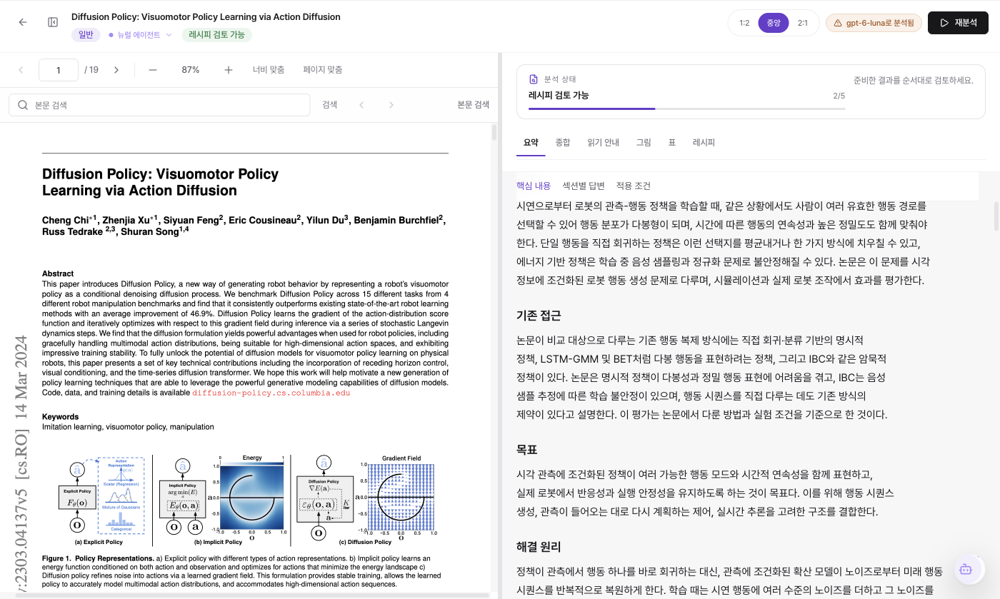
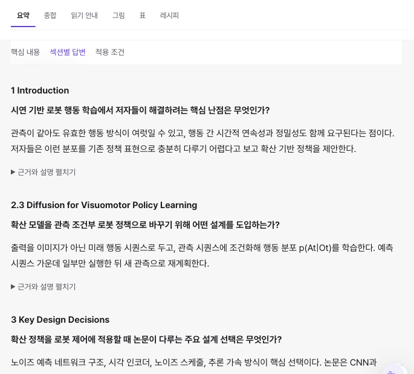
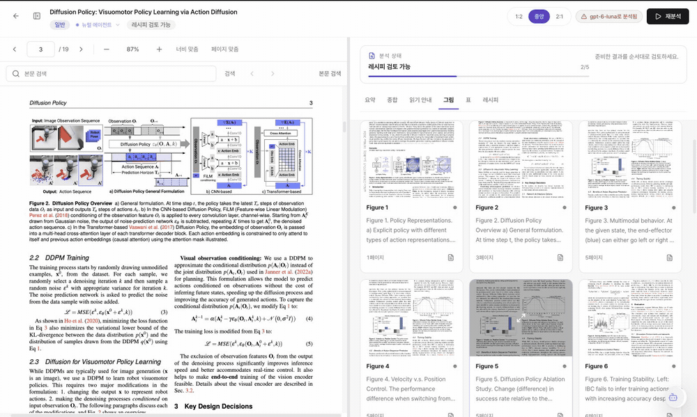
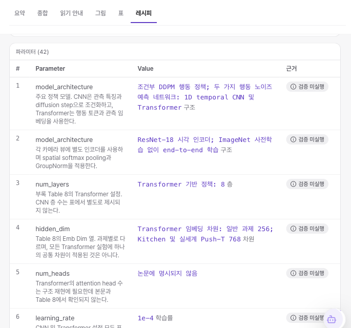

<div align="center">


# Sasoo

### Read the paper. Return to the evidence.

An AI research workbench for understanding a paper, checking its figures and tables, and collecting experimental details alongside the original PDF.

<p align="center">
  <a href="sasoo/package.json"></a>
  <a href="sasoo/frontend/package.json"></a>
  <a href="sasoo/frontend/package.json"></a>
  <a href="sasoo/frontend/package.json"></a>
  <a href="sasoo/frontend/package.json"></a>
  <a href=".github/workflows/release.yml"></a>
</p>

<p align="center">
  <a href="sasoo/backend/requirements.txt"></a>
  <a href="sasoo/backend/requirements.txt"></a>
  <a href="sasoo/frontend/package.json"></a>
  <a href="sasoo/frontend/package.json"></a>
  <a href="sasoo/backend/services/model_registry.py"></a>
  <a href="sasoo/backend/services/model_registry.py"></a>
</p>

<sub>Development stack. Each badge links to its dependency or model configuration.</sub>

[**Download**](https://github.com/dosigner/sasoo/releases/latest) | [Get started](#get-started) | [Development](#development) | [한국어](README.md)


</div>

## Keep the source beside the explanation

Sasoo keeps the original paper within reach while you read. Start with the summary, follow questions through each section, and open linked figures and tables to check the evidence. PDFs and analysis results stay in a local library so you can return to them later.

> **Development preview:** The screens and features below reflect the development working tree on September 25, 2026. They show the Korean UI with saved analysis results, including some uncommitted interface changes. The public download is [v1.0.0](https://github.com/dosigner/sasoo/releases/tag/v1.0.0); its interface and features may differ. v1.0.1 is under validation.

<p align="center">
  
</p>

## A paper's workflow

Upload a PDF and start analysis, then move between the explanation and the source as you read. Reopen saved results from your library whenever you need them.

<p align="center">
  <a href="sasoo/docs/assets/architecture-2026-09-25/reading-workflow.en.svg"></a>
</p>

[Full-size diagram](sasoo/docs/assets/architecture-2026-09-25/reading-workflow.en.svg) | [Explorable HTML](sasoo/docs/assets/architecture-2026-09-25/reading-workflow.en.html)

Diagrams were built with Archify. Download the HTML and open it in a browser to search, zoom, and explore connections. Viewer controls are in English.

## Tools for reading

### Read through questions

The **Summary** covers the problem, prior approaches, mechanism, results, and limitations. Scan the section questions and short answers, then expand the evidence and explanation where you need more detail. The **Reading guide** gathers questions and conditions to check in the paper.

<p align="center">
  
</p>

### Open the evidence, then return to your place

Select a linked Figure or Table in the summary to open the source material and its PDF page. **Return to summary** takes you back to where you were reading. Navigation is available for references with a corresponding source item.

<p align="center">
  
</p>

Select a summary reference → inspect the figure and PDF page → return to the summary. Figure previews in this demo use original PDF pages. [View a still image](sasoo/docs/assets/readme-2026-09-25/evidence-source.png).

### Carry experimental details into your next task

The **Recipe** collects experimental steps and parameters, with CSV export. Review each value together with its evidence status and missing information. The **Not verified** labels (`검증 미실행`) in this example mean that no evidence verification has been recorded for those values.

<p align="center">
  
</p>

The workbench has six tabs: **Summary, Synthesis, Reading guide, Figures, Tables, and Recipe**. Synthesis brings the main findings together, while chat lets you ask follow-up questions about the paper and analysis. Domain agents adapt explanations for optics (Photon), biology (Cell), deep learning (Neural), and circuits (Circuit). You can extend the agents with Markdown files in the user data directory.

Check AI explanations and extracted values against the paper. A completed analysis or source link does not guarantee accuracy or experimental reproducibility. Analysis based on part of a paper is not a review of the whole source. These screens demonstrate how saved responses are displayed and explored; see [capture provenance and scope](sasoo/docs/assets/readme-2026-09-25/PROVENANCE.md) for details.

## Get started

1. **Install:** Download the file for your platform from [official GitHub Releases](https://github.com/dosigner/sasoo/releases/latest) and install the app.
2. **Configure:** Enter your provider's API key, then check the selected provider, library location, and automatic analysis setting.
3. **Read your first paper:** Upload a PDF, start analysis, and read the results beside the source. With automatic analysis enabled, an upload may start API requests immediately.

**External AI API charges are separate.** You need an API key with access to the models in use. Free analysis is not guaranteed.

### Downloads

The public release checked on September 25, 2026 is **v1.0.0**.

| Platform | Official release file | Notes |
| --- | --- | --- |
| macOS Apple Silicon | [DMG](https://github.com/dosigner/sasoo/releases/download/v1.0.0/Sasoo-1.0.0-arm64.dmg) / [ZIP](https://github.com/dosigner/sasoo/releases/download/v1.0.0/Sasoo-1.0.0-arm64-mac.zip) | Unsigned and unnotarized |
| Windows x64 | [Installer EXE](https://github.com/dosigner/sasoo/releases/download/v1.0.0/Sasoo-Setup-1.0.0.exe) | Unsigned; SmartScreen may warn |

Official Linux and Intel Mac binaries are not available. A Linux source build command exists, but Linux is outside the distribution support listed above.

<details>
<summary>If macOS blocks the app</summary>

Move `Sasoo.app` from the official release to `/Applications`. Use the following command only if Gatekeeper blocks that app and you have checked its source.

```bash
xattr -dr com.apple.quarantine /Applications/Sasoo.app
```

If needed, right-click the app in Finder and choose **Open**. This removes quarantine protection; it does not verify the publisher or replace Apple signing or notarization. Do not use it on third-party copies.

</details>

<details>
<summary>If Windows shows a SmartScreen warning</summary>

Run the installer EXE from the official release. An unsigned build may appear as an unknown publisher. Choose **More info → Run anyway** only after checking the official download source.

</details>

## API keys and costs

Choose OpenAI or Gemini in Settings. If only one provider has a saved key, the app selects the available provider. A saved key can still fail because of billing, permissions, or model access restrictions.

| Provider | Get an API key | Features |
| --- | --- | --- |
| OpenAI | [OpenAI API keys](https://platform.openai.com/api-keys) | Paper analysis, chat, figure explanations, concept illustrations |
| Gemini | [Google AI Studio](https://aistudio.google.com/apikey) | Paper analysis, chat, figure explanations, concept illustrations |

The development source defaults to OpenAI with `gpt-5.6-luna` for text analysis. Image models and assignments for individual stages are managed separately. See the [model registry](sasoo/backend/services/model_registry.py) and [model IDs](sasoo/backend/services/models.py) for the actual configuration.

Costs shown in Settings are **estimates** based on reported usage and the rates registered in the app. They may differ from provider invoices. Missing usage does not mean a request was free.

## Data and privacy

**Files are stored locally; AI processing uses external APIs.** PDFs and analysis results are saved in your local library. Analysis, chat, and image generation send the material needed for the feature to the selected provider.

| Task | Material that may be sent to external APIs |
| --- | --- |
| Paper analysis | Original PDFs, extracted text, figure and table images |
| Chat / figure explanations | Questions, relevant source and analysis content, target images |
| Concept illustrations | Descriptions derived from analysis and generation requests |

OpenAI analysis in the development source attaches the original PDF as `input_file`; Gemini analysis can also upload PDFs to the provider. Local Java extraction may be followed by external transmission for AI processing. Generated concept illustrations are distinct from original paper figures.

Use documents you are allowed to transmit and review the provider's data policy. API keys are encrypted locally, with the encryption key held in the OS credential store, such as macOS Keychain or Windows Credential Manager. Legacy `.sasoo_key` values migrate when possible. Keys that cannot migrate or have been revoked must be entered again.

## Development

The app lives in `sasoo/`. Electron runs the React/Vite interface and a local FastAPI backend, with SQLite and filesystem storage. PDF extraction uses the Java-based OpenDataLoader.

### System architecture

The diagram connects the local interface, analysis engine, storage, and external AI providers. Documents are stored locally; AI features send the required content to external APIs.

<p align="center">
  <a href="sasoo/docs/assets/architecture-2026-09-25/system-architecture.en.svg"></a>
</p>

[Full-size diagram](sasoo/docs/assets/architecture-2026-09-25/system-architecture.en.svg) | [Explorable HTML](sasoo/docs/assets/architecture-2026-09-25/system-architecture.en.html)

### Analysis pipeline

After preparing the PDF context, the app runs the main analysis stages in this order. Screening results determine the domain agent used for the paper.

<p align="center">
  <a href="sasoo/docs/assets/architecture-2026-09-25/analysis-pipeline.en.svg"></a>
</p>

[Full-size diagram](sasoo/docs/assets/architecture-2026-09-25/analysis-pipeline.en.svg) | [Explorable HTML](sasoo/docs/assets/architecture-2026-09-25/analysis-pipeline.en.html)

This diagram shows the order of the main stages. Stages may be skipped or interrupted depending on the paper and run state. Synthesis and additional visualizations are generated separately. See [analysis_execution.py](sasoo/backend/services/analysis_execution.py) for the execution logic.

### Run locally

The [package requirements](sasoo/package.json) specify **Node.js 22.13 or later**. [Release CI](.github/workflows/release.yml) uses **Node.js 24, pnpm 10, Python 3.12, and Java 21**; use these versions as the baseline for local setup. You can select the Java runtime for PDF extraction through `JAVA_HOME` or `SASOO_JAVA_HOME`.

```bash
git clone https://github.com/dosigner/sasoo.git
cd sasoo/sasoo
pnpm install --frozen-lockfile
python3.12 -m venv backend/.venv
source backend/.venv/bin/activate
python -m pip install -r backend/requirements.txt -r backend/requirements-test.txt pyinstaller
pnpm dev
```

These commands use a macOS/Linux shell. In Windows PowerShell, create the environment with `py -3.12 -m venv backend/.venv` and activate it with `.\backend\.venv\Scripts\Activate.ps1`.

<details>
<summary>Tests and packaging</summary>

Run from `sasoo/`:

```bash
pnpm --dir=frontend test
pnpm --dir=frontend tsc --noEmit
pnpm --dir=frontend lint
pnpm test:unit
```

Run backend tests with the Python virtual environment activated:

```bash
cd backend
python -m pytest services api models
cd ..
```

```bash
pnpm build:mac:release  # Run on macOS.
pnpm build:win:release  # Run on Windows.
```

Plain `pnpm build` does not rebuild the backend. The platform release commands include backend packaging and artifact checks. Development GUI checks, scientific source review, and installed package checks are separate requirements. Producing a Windows installer does not establish that the app works on a Windows machine.

See the [release checklist](sasoo/docs/03-release/release-checklist.md) and [release workflow](.github/workflows/release.yml) for packaging details.

</details>

## License

The package metadata declares [MIT](sasoo/package.json). A separate project `LICENSE` file has not yet been added to the repository.
