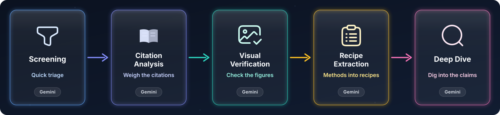
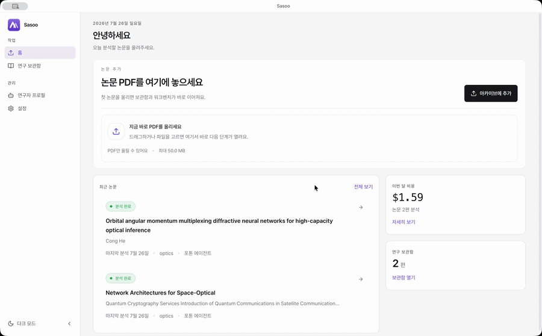
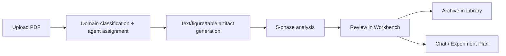
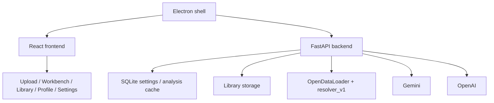

<div align="center">


# Sasoo

### An AI research workbench that builds the paper's structure before you read, interprets figures while you read, and keeps reproduction parameters after you read

<p>
  <a href="https://github.com/dosigner/sasoo/releases/latest">
    
  </a>
  
</p>

<p>
  
  
  
  
  
</p>

<p>
  <a href="https://github.com/dosigner/sasoo/releases">
    
  </a>
</p>

<p>
  Sasoo does not just summarize PDFs.<br/>
  It organizes papers into archivable units, attaches domain-specific agents, and keeps figures/tables and recipes in a form you can pull back up later.
</p>

</div>

<div align="center">
  
</div>

<!-- Uncomment after recording the demo GIF (see docs/marketing/demo-scenario.md)
<div align="center">
  
</div>
-->

<!-- README-I18N:START -->

[한국어](./README.md) | **English**

<!-- README-I18N:END -->

---

<div align="center">
  
  <p><sub>Before — build the structure · During — interpret the figures · After — keep what it takes to reproduce</sub></p>
</div>

## Get started in 3 minutes

A free Gemini key is enough to try it out at no cost.

1. **Download** — Get `Sasoo-<version>-arm64.dmg` (macOS Apple Silicon) from [GitHub Releases](https://github.com/dosigner/sasoo/releases/latest).
2. **Install** — Move `Sasoo.app` to `/Applications`. If launch is blocked, follow the one-command [macOS note](#macos-note) procedure below.
3. **Free API key** — Sign in with your Google account at [Google AI Studio](https://aistudio.google.com/apikey) and click `Get API key`. No credit card required, and the free-tier key alone drives core analysis.
4. **First analysis** — Launch the app, enter the key in `Settings`, then drag in a PDF to kick off domain detection and the 5-phase analysis.

## Why Sasoo

<table>
<tr>
<td width="33%" valign="top">
<strong>Archive-first</strong><br/>
A paper you upload once is never done. The PDF, figures, tables, recipes, question history, and reports all stay in your library.
</td>
<td width="33%" valign="top">
<strong>Figure-aware</strong><br/>
Beyond text summaries, it extracts figures/tables, matches captions, reviews visual quality, and explains each figure individually.
</td>
<td width="33%" valign="top">
<strong>Agent-routed</strong><br/>
Attach optics, bio, deep learning, or circuit agents — or add your own by dropping `.md` files into the user data folder — so each paper is read through the right lens.
</td>
</tr>
</table>

## Current Release

The current release is [`v0.7.1`](https://github.com/dosigner/sasoo/releases/latest), distributed as an unsigned ZIP and DMG for macOS Apple Silicon.

- The macOS Apple Silicon build is distributed as an unsigned ZIP/DMG and requires the `xattr` procedure below.
- Includes stabilization of desktop settings persistence and library path handling.
- The `resolver_v1`-based figure/table extraction path is the default.
- Release builds bundle the Java-based OpenDataLoader runtime.
- The Workbench, Library, researcher Profile, Settings, and Experiment Plan flows ship as one coherent package.

## What You Get

| Surface | What it does |
| --- | --- |
| Upload | Upload PDFs, validate files, browse recent analyses/library history, confirm the detected domain and assigned agent |
| Workbench | Review summary, figures, tables, recipes, experiment plans, and chat side by side with the PDF viewer |
| Library | Search and reopen papers by title, author, DOI, tags, status, and year |
| Profile | Researcher profile that manages your research background and default explanation depth |
| Settings | Manage Gemini/OpenAI keys, library path, auto-analysis, theme, extraction pipeline, and the cost dashboard |

## Domain Agents

| Agent | Focus |
| --- | --- |
| **Photon** | Optics, lasers, FSO, experimental setup review |
| **Cell** | Biology, molecular biology, sample sizes and experimental conditions |
| **Neural** | Deep learning, CV, NLP, ablations and comparison experiments |
| **Circuit** | Circuits, semiconductors, signal processing, conditions and FoM |
| **User overrides** | Extend the agents by dropping `.md` files into the user data folder |

## Workflow



### 5-Phase Analysis

1. `Screening`
   Quickly filters the paper's domain, core claims, experimental nature, and relevance.
2. `Citation Analysis`
   Organizes references and analyzes citation frequency and roles.
3. `Visual Verification`
   Checks axes, quality, caption context, and visual artifact status, centered on figures/tables.
4. `Recipe Extraction`
   Extracts methodology and experimental parameters into structured recipe cards.
5. `Deep Dive`
   Expands into claims, evidence, weak points, follow-up questions, and Mermaid-based explanation flows.

## Installation

| Platform | Asset | Notes |
| --- | --- | --- |
| Windows 10/11 | [GitHub Releases](https://github.com/dosigner/sasoo/releases) | Available only when a new-version asset is published |
| macOS Apple Silicon | `Sasoo-<version>-arm64-mac.zip` · `Sasoo-<version>-arm64.dmg` | Unsigned ZIP/DMG from the official GitHub Release |
| Linux | source build | No GitHub release asset is provided yet |

### macOS note

The macOS build is not signed or notarized with an Apple Developer ID. Gatekeeper may block it, and the command below is an explicit workaround that removes the quarantine attribute from this app.

1. Download the ZIP only from the official [`dosigner/sasoo` GitHub Releases](https://github.com/dosigner/sasoo/releases). Do not use this procedure on a copy re-uploaded by a third party.
2. Unzip it and move `Sasoo.app` to `/Applications`.
3. Only if launch is blocked, run this command in Terminal:

```bash
xattr -dr com.apple.quarantine /Applications/Sasoo.app
```

4. In Finder, right-click `Sasoo.app` and choose `Open` once.

> [!WARNING]
> This command does not make the app pass Apple's signing or notarization checks; it removes quarantine protection. Use it only for the official Sasoo app whose source you have verified, and check the command path carefully if the ZIP or app is stored elsewhere.

## API Keys

Core analysis runs on the `Gemini` key alone. A Gemini key can be issued for free from [Google AI Studio](https://aistudio.google.com/apikey) on the free tier. Since the default image-generation path uses OpenAI, it is best to also configure an `OpenAI` key to use it as-is.

- Gemini: screening, visual analysis, deep dive, Mermaid/diagram generation, and most text/vision analysis
- OpenAI: figure/image generation (the default image provider — switch image generation to Gemini in `Settings` to run without an OpenAI key)

You can enter both in `Settings` right after installing.

The encryption key for API keys is stored in the operating system credential store by default, such as macOS Keychain or Windows Credential Manager. Values encrypted with the legacy `.sasoo_key` are migrated on first launch, after which that file is removed.

## Quick Start

1. Install and launch the app.
2. Check your API keys and library storage path in `Settings`.
3. Upload a PDF.
4. Confirm the detected domain and agent, then enter the Workbench.
5. Start the analysis and review the summary, figures, tables, and recipes in order.
6. If needed, use chat and the experiment plan for follow-up questions and a reproduction plan.

## Architecture



### Main pieces

- Frontend: React 18 + TypeScript + Vite
- Desktop shell: Electron
- Backend API: FastAPI
- Persistence: SQLite + filesystem library storage
- Extraction: Java-based OpenDataLoader, resolver-based figure/table pipeline
- LLM layer: Gemini (text/vision analysis) + OpenAI (image generation)

## Local Development

The repository root holds documentation and release files; the actual app code lives under `sasoo/`.

```bash
git clone https://github.com/dosigner/sasoo.git
cd sasoo/sasoo
pnpm install
python3 -m venv backend/.venv
source backend/.venv/bin/activate
pip install -r backend/requirements.txt pyinstaller
pnpm dev
```

### Useful commands

```bash
pnpm dev
pnpm build:mac:release
pnpm build:win:release
pnpm build:linux
```

### Release references

- GitHub Actions workflow: [`/.github/workflows/release.yml`](.github/workflows/release.yml)
- Release checklist: [`/sasoo/docs/03-release/release-checklist.md`](sasoo/docs/03-release/release-checklist.md)
- Electron build plan: [`/sasoo/docs/03-release/electron-build-plan.md`](sasoo/docs/03-release/electron-build-plan.md)

## Repository Map

```text
.
├── README.md
├── .github/workflows/release.yml
└── sasoo/
    ├── frontend/
    │   ├── src/pages/
    │   ├── src/components/
    │   └── src/lib/
    ├── backend/
    │   ├── api/
    │   ├── services/
    │   ├── models/
    │   └── agents/
    ├── electron/
    ├── scripts/
    └── docs/03-release/
```

## Notes For Reviewers

- The current release is [`v0.7.1`](https://github.com/dosigner/sasoo/releases/latest); the official GitHub Releases provide the macOS unsigned ZIP/DMG.
- Public macOS builds currently follow the unsigned-ZIP policy and use the limited `xattr` installation procedure documented in this README.
- When a release is re-tagged, GitHub's auto-generated changelog can produce reversed comparison links, so reviewing the release notes manually is safer.

## License

[MIT](LICENSE)
