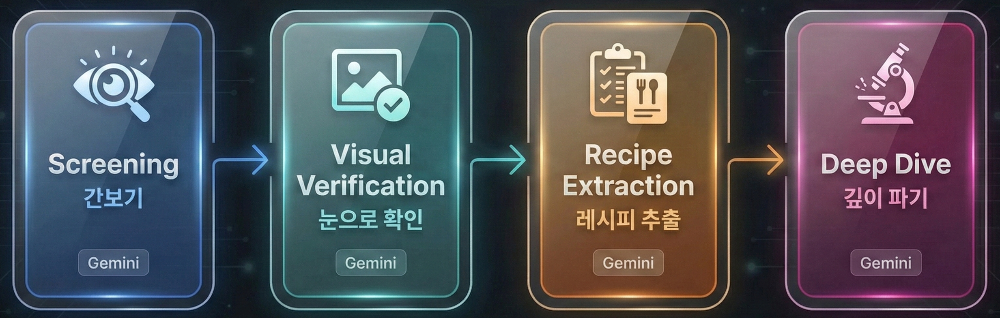
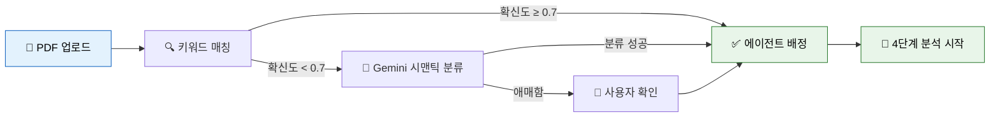
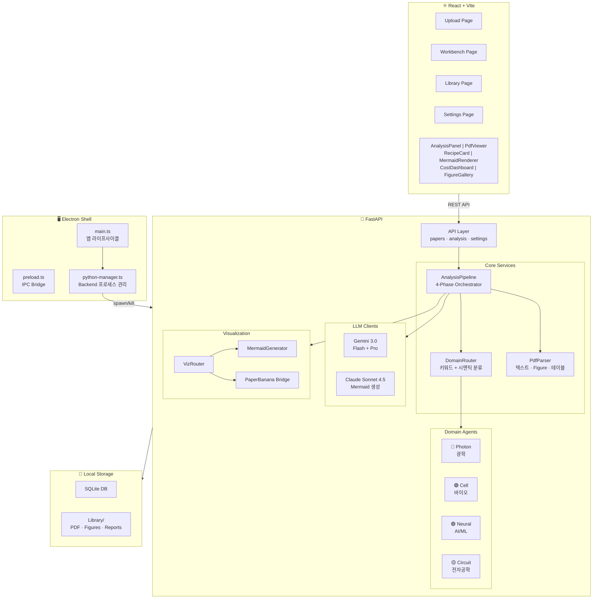

<div align="center">

<br/>


# Sasoo (사수)

### 논문을 같이 읽어주는 AI 연구실 동료

<br/>

연구실에 들어왔는데 사수가 없다고?<br/>
**Sasoo가 네 사수가 되어줄게.**<br/>
PDF 던져주면 4단계로 쪼개서 분석하고, 레시피 카드까지 뽑아줌.

<br/>

[](LICENSE)
[](https://github.com/dosigner/sasoo/releases/tag/v0.1.0)
[]()
[]()
[]()
[]()

[]()
[]()
[]()
[]()
[]()
[]()

<br/>



<br/>

<a href="https://github.com/dosigner/sasoo/releases/tag/v0.1.0">

</a>

</div>

<br/>

<details>
<summary><b>📑 목차</b></summary>

- [다운로드](#-다운로드)
- [컨셉: 연구실 사수](#-컨셉--연구실-사수)
- [한눈에 보는 워크플로우](#-한눈에-보는-워크플로우)
- [주요 기능](#-주요-기능)
- [아키텍처](#-아키텍처)
- [시작하기](#-시작하기)
- [4단계 분석 파이프라인](#-4단계-분석-파이프라인)
- [AI 에이전트 시스템](#-ai-에이전트-시스템)
- [기술 스택](#-기술-스택)
- [프로젝트 구조](#-프로젝트-구조)
  - [저장 경로 구조](#저장-경로-구조)
- [빌드 & 배포](#-빌드--배포)
- [로드맵](#-로드맵)
- [기여 & 라이선스](#-기여--라이선스)

</details>

<br/>

---

<br/>

## 🧑‍🔬 컨셉 — 연구실 사수

<br/>

<div align="center">

> _"대학원 들어왔는데 사수가 없다._
> _논문 읽는 법을 모른다._
> _Figure가 뭘 말하는지 모르겠다."_

</div>

<br/>

Sasoo(사수)는 이 문제를 해결하기 위해 만들어졌다.

논문을 던져주면, 마치 **연구실 선배가 옆에서 같이 읽어주듯** 4단계에 걸쳐 분석해준다. 각 분야에는 성격이 다른 **전문 에이전트(선배)**가 배치되어 있다:

<br/>

<div align="center">
<table>
<tr>
<td align="center" width="220">
<br/>

<h4>Photon 선배</h4>
<sub>광학 · 레이저 · FSO</sub><br/><br/>
<b>직설적 🔥</b><br/><br/>
<em>"이거 봐봐,<br/>error bar가 없잖아"</em>
<br/><br/>
</td>
<td align="center" width="220">
<br/>

<h4>Cell 선배</h4>
<sub>바이오 · 분자생물학</sub><br/><br/>
<b>꼼꼼함 🔬</b><br/><br/>
<em>"n수가 적은데?<br/>통계 어떻게 한 거야?"</em>
<br/><br/>
</td>
<td align="center" width="220">
<br/>

<h4>Neural 선배</h4>
<sub>딥러닝 · NLP · CV</sub><br/><br/>
<b>분석적 🧠</b><br/><br/>
<em>"ablation이 빠져있네,<br/>이 loss는 좀 이상한데?"</em>
<br/><br/>
</td>
<td align="center" width="220">
<br/>

<h4>Circuit 선배</h4>
<sub>회로 · 반도체 · 신호처리</sub><br/><br/>
<b>체계적 ⚡</b><br/><br/>
<em>"이 회로 시뮬레이션<br/>조건이 좀 빠져있어"</em>
<br/><br/>
</td>
</tr>
</table>
</div>

<br/>

### 선배는 어떻게 배정될까?

논문을 업로드하면 **DomainRouter**가 자동으로 적합한 선배를 찾아준다:

<div align="center">



</div>

배정된 선배는 본인 분야에 맞는 **전용 프롬프트**로 분석한다. 광학 논문에는 wavelength·beam quality를, 바이오 논문에는 cell line·passage number를 체크하는 식이다.

<br/>

---

<br/>

## 🎯 한눈에 보는 워크플로우

<br/>

<div align="center">
<table>
<tr>
<td align="center" width="160">
<h1>📄</h1>
<h4>1. Upload</h4>
<sub>PDF 드래그 앤 드롭</sub>
</td>
<td align="center" width="40">
<h3>→</h3>
</td>
<td align="center" width="160">
<h1>🤖</h1>
<h4>2. 자동 분류</h4>
<sub>DomainRouter가<br/>분야 감지 + 선배 배정</sub>
</td>
<td align="center" width="40">
<h3>→</h3>
</td>
<td align="center" width="160">
<h1>⚗️</h1>
<h4>3. 4단계 분석</h4>
<sub>파이프라인 순차 실행<br/>진행률 실시간 표시</sub>
</td>
<td align="center" width="40">
<h3>→</h3>
</td>
<td align="center" width="160">
<h1>🔬</h1>
<h4>4. Workbench</h4>
<sub>PDF + 분석 결과<br/>Figure + Mermaid</sub>
</td>
<td align="center" width="40">
<h3>→</h3>
</td>
<td align="center" width="160">
<h1>📚</h1>
<h4>5. Library</h4>
<sub>분석된 논문<br/>검색 · 관리</sub>
</td>
</tr>
</table>
</div>

<br/>

---

<br/>

## ✨ 주요 기능

<br/>

<div align="center">
<table>
<tr>
<td width="60" align="center">⚗️</td>
<td><b>4단계 분석</b></td>
<td>Screening → Visual Verification → Recipe Extraction → Deep Dive</td>
</tr>
<tr>
<td align="center">🧑‍🔬</td>
<td><b>도메인 에이전트</b></td>
<td>분야별 전문 선배가 맞춤 분석 (Photon, Cell, Neural, Circuit)</td>
</tr>
<tr>
<td align="center">🧠</td>
<td><b>듀얼 LLM</b></td>
<td>Gemini 3.0 (분석) + Claude Sonnet 4.5 (시각화) 전략적 분업</td>
</tr>
<tr>
<td align="center">🖼️</td>
<td><b>Figure-First</b></td>
<td>PDF에서 Figure 자동 추출 → 캡션 매칭 → 데이터 품질 평가</td>
</tr>
<tr>
<td align="center">🧾</td>
<td><b>Recipe Card</b></td>
<td>실험 파라미터를 <code>[EXPLICIT]</code> <code>[INFERRED]</code> <code>[MISSING]</code> 태그로 정리</td>
</tr>
<tr>
<td align="center">💰</td>
<td><b>토큰 절감</b></td>
<td>섹션 분할로 필요한 부분만 전송, Flash/Pro 모델 전략 배분</td>
</tr>
<tr>
<td align="center">📊</td>
<td><b>비용 대시보드</b></td>
<td>단계별 토큰 수·비용 실시간 추적 ($0.004~$0.076/논문)</td>
</tr>
<tr>
<td align="center">🔒</td>
<td><b>로컬 퍼스트</b></td>
<td>SQLite + 로컬 파일 저장, 인터넷은 API 호출에만 사용</td>
</tr>
</table>
</div>

<br/>

---

<br/>

## 🏗️ 아키텍처

<br/>



<br/>

---

<br/>

## ⬇️ 다운로드

<br/>

<div align="center">

> **설치파일을 받아서 바로 사용하고 싶다면?**

<table>
<tr>
<td align="center" width="400">
<br/>
<h3>🪟 Windows</h3>
<a href="https://github.com/dosigner/sasoo/releases/tag/v0.1.0">

</a>
<br/><br/>
<sub>Windows 10/11 · 약 144MB · NSIS 인스톨러</sub>
<br/><br/>
</td>
</tr>
</table>

<sub>macOS / Linux 빌드는 <a href="#-빌드--배포">빌드 & 배포</a> 섹션 참고</sub>

</div>

<br/>

> **API 키 필요**: 설치 후 Settings에서 Gemini API Key를 입력해야 분석 기능을 사용할 수 있습니다.
> 키 발급: [aistudio.google.com](https://aistudio.google.com)

<br/>

---

<br/>

## 🚀 시작하기

<br/>

### 필수 요구사항

| 항목 | 버전 | 비고 |
|:-----|:-----|:-----|
| **Node.js** | 18+ | [nodejs.org](https://nodejs.org) |
| **pnpm** | latest | `npm i -g pnpm` |
| **Python** | 3.10+ | [python.org](https://python.org) |
| **Gemini API Key** | — | [aistudio.google.com](https://aistudio.google.com) |
| **Anthropic API Key** | — | [console.anthropic.com](https://console.anthropic.com) (시각화용, 선택) |

<br/>

### 🧑‍💻 Human (수동 설치)

<table>
<tr><td>

**Step 1** — 저장소 클론

```bash
git clone https://github.com/dosigner/sasoo.git
cd sasoo
```

</td></tr>
<tr><td>

**Step 2** — 프론트엔드 의존성 설치

```bash
pnpm install          # 루트 + frontend 자동 설치 (postinstall)
```

</td></tr>
<tr><td>

**Step 3** — 백엔드 Python 환경

```bash
cd backend
python -m venv .venv

# Windows
.venv\Scripts\activate
# macOS/Linux
source .venv/bin/activate

pip install -r requirements.txt
cd ..
```

</td></tr>
<tr><td>

**Step 4** — API 키 설정

```bash
# backend/.env 파일 생성
echo "GEMINI_API_KEY=your-gemini-key" > backend/.env
echo "ANTHROPIC_API_KEY=your-anthropic-key" >> backend/.env
```

> 또는 앱 실행 후 **Settings** 페이지에서 직접 입력 가능

</td></tr>
<tr><td>

**Step 5** — 실행!

```bash
pnpm dev              # Frontend(Vite) + Electron 동시 실행
```

> 백엔드는 Electron이 `python-manager.ts`를 통해 자동 기동한다.
> 수동 실행: `cd backend && python main.py --reload`

</td></tr>
</table>

<br/>

### 🤖 Agent (자동 설치)

```bash
# 원라인 (macOS/Linux)
git clone https://github.com/dosigner/sasoo.git && cd sasoo && bash scripts/setup.sh
```

<details>
<summary>setup.sh 내용</summary>

```bash
#!/bin/bash
set -e
echo "=== Sasoo Setup ==="
pnpm install
cd backend && python3 -m venv .venv && source .venv/bin/activate && pip install -r requirements.txt && cd ..
read -p "Gemini API Key: " GEMINI_KEY
read -p "Anthropic API Key (optional, Enter to skip): " ANTHROPIC_KEY
echo "GEMINI_API_KEY=$GEMINI_KEY" > backend/.env
[ -n "$ANTHROPIC_KEY" ] && echo "ANTHROPIC_API_KEY=$ANTHROPIC_KEY" >> backend/.env
echo "=== Done! Run: pnpm dev ==="
```

</details>

<details>
<summary>PowerShell 버전 (Windows)</summary>

```powershell
git clone https://github.com/dosigner/sasoo.git; cd sasoo
pnpm install
cd backend; python -m venv .venv; .\.venv\Scripts\Activate.ps1; pip install -r requirements.txt; cd ..
$gemini = Read-Host "Gemini API Key"
$anthropic = Read-Host "Anthropic API Key (optional)"
"GEMINI_API_KEY=$gemini" | Out-File backend/.env -Encoding utf8
if ($anthropic) { "ANTHROPIC_API_KEY=$anthropic" | Add-Content backend/.env }
Write-Host "Done! Run: pnpm dev"
```

</details>

<br/>

---

<br/>

## ⚗️ 4단계 분석 파이프라인

<br/>

<div align="center">

</div>

<br/>

<div align="center">
<table>
<tr>
<td align="center" width="220">
<br/>
<h3>Phase 1</h3>
<h2>👀</h2>
<h4>Screening</h4>
<sub><b>간보기</b></sub><br/><br/>
<code>Gemini Flash</code><br/>
<sub>Thinking: 1K tokens</sub><br/><br/>
<sub>📥 Abstract + Conclusion</sub><br/>
<sub>📤 도메인 분류, 관련성 점수,<br/>핵심 주장, 빨간 깃발</sub>
<br/><br/>
<em>"일단 한번 훑어볼게"</em>
<br/><br/>
</td>
<td align="center" width="220">
<br/>
<h3>Phase 2</h3>
<h2>🖼️</h2>
<h4>Visual Verification</h4>
<sub><b>눈으로 확인</b></sub><br/><br/>
<code>Gemini Flash</code><br/>
<sub>Thinking: 4K tokens</sub><br/><br/>
<sub>📥 Figures + Captions</sub><br/>
<sub>📤 Figure별 품질 평가,<br/>축·에러바·데이터 품질</sub>
<br/><br/>
<em>"Figure 좀 볼게.<br/>이거 축이 뭐야?"</em>
<br/><br/>
</td>
<td align="center" width="220">
<br/>
<h3>Phase 3</h3>
<h2>🧾</h2>
<h4>Recipe Extraction</h4>
<sub><b>레시피 추출</b></sub><br/><br/>
<code>Gemini Pro</code><br/>
<sub>Thinking: 8K tokens</sub><br/><br/>
<sub>📥 Methods 섹션</sub><br/>
<sub>📤 파라미터 태깅,<br/>재현성 점수, 누락 경고</sub>
<br/><br/>
<em>"이거 내가<br/>따라할 수 있겠어?"</em>
<br/><br/>
</td>
<td align="center" width="220">
<br/>
<h3>Phase 4</h3>
<h2>🔬</h2>
<h4>Deep Dive</h4>
<sub><b>깊이 파기</b></sub><br/><br/>
<code>Gemini Pro</code><br/>
<sub>Thinking: 8K tokens</sub><br/><br/>
<sub>📥 Intro + Results</sub><br/>
<sub>📤 Claim↔Evidence,<br/>오류 전파, 한계점</sub>
<br/><br/>
<em>"이제 진짜 파보자"</em>
<br/><br/>
</td>
</tr>
</table>
</div>

<br/>

<details>
<summary><b>각 단계 상세 설명</b></summary>

<br/>

#### Phase 1: Screening

Abstract와 Conclusion만 읽고 빠르게 판단한다. Gemini Flash + 최소 thinking으로 비용 절감:

- 도메인 분류 (optics / biology / ai_ml / ee)
- 관련성 점수 (0.0–1.0)
- 핵심 주장 최대 5개
- 방법론 유형 (experimental / computational / theoretical / review / mixed)
- 빨간 깃발 (red flags)

#### Phase 2: Visual Verification

PDF에서 추출한 Figure 이미지를 **멀티모달**로 직접 분석:

- Figure 유형 (graph, microscopy, schematic, photo 등)
- 축 레이블·단위 확인
- Error bar 유무
- 데이터 품질 등급 (excellent / good / fair / poor)

#### Phase 3: Recipe Extraction

Methods 섹션에서 실험 파라미터를 추출하고 태그:

- 🟢 `[EXPLICIT]` — 논문에 명시됨
- 🟡 `[INFERRED]` — 문맥에서 추론
- 🔴 `[MISSING]` — 누락, 재현 불가

재현성 점수(0.0–1.0)와 누락 핵심 파라미터 목록 제공.

#### Phase 4: Deep Dive

Introduction과 Results & Discussion을 깊이 분석:

- Claim vs Evidence 매핑 (strong / moderate / weak / unsupported)
- Error propagation 분석
- 물리적 제약 조건 검증
- Novelty 평가
- 종합 점수 (0.0–10.0)

</details>

<br/>

---

<br/>

## 🧑‍🔬 AI 에이전트 시스템

<br/>

### 에이전트 프로필

각 에이전트는 `BaseAgent`를 상속하며, 4단계별 **전용 프롬프트**를 가진다.

<div align="center">
<table>
<tr>
<th width="130">에이전트</th>
<th width="200">도메인</th>
<th width="100">성격</th>
<th>Phase 3 체크 파라미터</th>
</tr>
<tr>
<td align="center">🔴 <b>Photon</b></td>
<td>광학, 레이저, FSO, 분광학</td>
<td align="center">직설적 🔥</td>
<td><code>wavelength</code> <code>aperture</code> <code>beam_quality</code> <code>focal_length</code> <code>power</code></td>
</tr>
<tr>
<td align="center">🟢 <b>Cell</b></td>
<td>세포생물학, 분자생물학, 생명공학</td>
<td align="center">꼼꼼함 🔬</td>
<td><code>cell_line</code> <code>passage_number</code> <code>antibody_dilution</code> <code>pcr_cycles</code></td>
</tr>
<tr>
<td align="center">🟣 <b>Neural</b></td>
<td>딥러닝, NLP, CV, 강화학습</td>
<td align="center">분석적 🧠</td>
<td><code>learning_rate</code> <code>batch_size</code> <code>num_epochs</code> <code>model_architecture</code></td>
</tr>
<tr>
<td align="center">🟡 <b>Circuit</b></td>
<td>회로 설계, 반도체, 신호처리</td>
<td align="center">체계적 ⚡</td>
<td><code>supply_voltage</code> <code>frequency</code> <code>gain</code> <code>impedance</code></td>
</tr>
</table>
</div>

<br/>

### 듀얼 LLM 전략

Sasoo는 **두 개의 LLM을 전략적으로 분업**시킨다:

<div align="center">
<table>
<tr>
<td align="center" width="380">
<br/>
<h3>🔷 Gemini 3.0 — 분석 엔진</h3>
<sub>Flash (Phase 1-2) + Pro (Phase 3-4)</sub><br/><br/>
멀티모달 (Figure 직접 분석)<br/>
구조화 JSON 출력<br/>
Thinking budget 조절<br/>
비용 효율적
<br/><br/>
</td>
<td align="center" width="380">
<br/>
<h3>🔶 Claude Sonnet 4.5 — 시각화 엔진</h3>
<sub>Mermaid 다이어그램 전문</sub><br/><br/>
복잡한 구조 → 정확한 코드 변환<br/>
한국어 라벨 처리<br/>
자동 문법 수정<br/>
flowchart · sequence · state · class
<br/><br/>
</td>
</tr>
</table>
</div>

<br/>

**Gemini Thinking Budget:**

| 호출 | 모델 | Thinking | 이유 |
|:-----|:------|:--------:|:-----|
| Phase 1: Screening | Flash | `1,024` | 빠른 분류, 깊은 사고 불필요 |
| Phase 2: Visual | Flash | `4,096` | 전체 Figure 품질 평가 (축·에러바·데이터 품질) |
| Phase 3: Recipe | Pro | `8,192` | 파라미터 하나하나 꼼꼼한 추출 |
| Phase 4: DeepDive | Pro | `8,192` | Claim↔Evidence 매핑, 비판적 분석 |
| Viz Router | Flash | `4,096` | 시각화 유형 라우팅 |
| Domain 분류 | Flash | `1,024` | 키워드 매칭 보조 (시맨틱 fallback) |
| Figure 상세 설명 | Flash | `8,192` | 개별 Figure 전문가 해설 (on-demand, 캐싱) |

> **Phase 2 vs Figure 상세 설명**: Phase 2는 전체 Figure를 한번에 훑으며 **데이터 품질을 평가**하는 단계이고, Figure 상세 설명은 FigureGallery에서 개별 Figure를 클릭했을 때 **논문 전체 맥락 + 에이전트 페르소나**로 깊이 해석하는 별도 API다. 후자는 입력 컨텍스트가 무겁고(전체 텍스트 + 분석 결과) 사용자 기대치가 높아 `high`(8,192)를 사용하며, DB에 캐싱되어 Figure당 1회만 비용 발생한다.

<br/>

---

<br/>

## 🛠️ 기술 스택

<br/>

<div align="center">
<table>
<tr>
<td align="center" width="130"><b>Frontend</b></td>
<td>


</td>
</tr>
<tr>
<td align="center"><b>Backend</b></td>
<td>


</td>
</tr>
<tr>
<td align="center"><b>Desktop</b></td>
<td>

</td>
</tr>
<tr>
<td align="center"><b>AI / LLM</b></td>
<td>


</td>
</tr>
<tr>
<td align="center"><b>PDF</b></td>
<td>


</td>
</tr>
<tr>
<td align="center"><b>시각화</b></td>
<td>


</td>
</tr>
</table>
</div>

<br/>

---

<br/>

## 📂 프로젝트 구조

<details>
<summary><b>디렉토리 트리 (클릭해서 펼치기)</b></summary>

```
sasoo/
├── 📦 package.json                 # 루트 — Electron + 빌드 스크립트
│
├── 🐍 backend/
│   ├── main.py                     # FastAPI 엔트리포인트 (:8000)
│   ├── requirements.txt
│   ├── api/
│   │   ├── papers.py               # 논문 업로드·목록·삭제
│   │   ├── analysis.py             # 분석 실행·결과 조회
│   │   └── settings.py             # API 키·테마 설정
│   ├── models/
│   │   ├── database.py             # SQLite 비동기 DB
│   │   ├── paper.py                # ParsedPaper, Figure, Table
│   │   └── schemas.py              # Pydantic 스키마
│   └── services/
│       ├── analysis_pipeline.py    # 4단계 오케스트레이터
│       ├── domain_router.py        # 도메인 분류 + 에이전트 라우팅
│       ├── pdf_parser.py           # PDF → 텍스트·Figure·테이블
│       ├── pdf_cache.py            # PDF 텍스트 캐시
│       ├── section_splitter.py     # 섹션 자동 분할
│       ├── subfigure_detector.py   # Figure 자동 추출
│       ├── naming_service.py       # 논문 명명 규칙
│       ├── paper_library.py        # 라이브러리 관리
│       ├── report_generator.py     # Markdown 보고서
│       ├── pricing.py              # API 비용 추적
│       ├── agents/
│       │   ├── base_agent.py       # 에이전트 추상 클래스
│       │   ├── profile_loader.py   # 에이전트 프로필 로더
│       │   ├── agent_photon.py     # 🔴 광학 전문
│       │   ├── agent_cell.py       # 🟢 바이오 전문
│       │   ├── agent_neural.py     # 🟣 AI/ML 전문
│       │   └── agent_circuit.py   # 🟡 전자공학 전문
│       ├── llm/
│       │   ├── gemini_client.py    # Gemini API 래퍼
│       │   └── claude_client.py    # Claude API 래퍼
│       └── viz/
│           ├── viz_router.py       # 시각화 라우팅
│           ├── mermaid_generator.py
│           └── paperbanana_bridge.py
│
├── ⚛️ frontend/
│   └── src/
│       ├── App.tsx                 # 메인 앱 + 라우팅
│       ├── assets/
│       │   └── agents/             # 에이전트 캐릭터 이미지
│       │       ├── photon.png
│       │       ├── bio.png
│       │       ├── neural.png
│       │       └── circuit.png
│       ├── pages/
│       │   ├── Upload.tsx          # PDF 업로드 + 에이전트 카드
│       │   ├── Workbench.tsx       # 분석 워크벤치
│       │   ├── Library.tsx         # 논문 라이브러리
│       │   └── Settings.tsx        # 설정
│       ├── components/
│       │   ├── AnalysisPanel.tsx   # 분석 결과 + 에이전트 배지
│       │   ├── PdfViewer.tsx       # PDF 뷰어
│       │   ├── RecipeCard.tsx      # 레시피 카드
│       │   ├── FigureGallery.tsx   # Figure 갤러리
│       │   ├── MermaidRenderer.tsx # Mermaid 렌더러
│       │   ├── CostDashboard.tsx   # 비용 대시보드
│       │   ├── ProgressTracker.tsx # 진행률 표시기
│       │   ├── ErrorBoundary.tsx   # 에러 핸들링
│       │   └── Toast.tsx           # 토스트 알림
│       ├── hooks/
│       │   ├── useAnalysis.ts      # 분석 파이프라인 훅
│       │   ├── usePapers.ts        # 논문 관리 훅
│       │   └── useFocusTrap.ts     # 접근성 훅
│       └── lib/
│           ├── api.ts              # API 클라이언트
│           └── agents.ts           # 에이전트 메타데이터 + 헬퍼
│
├── 🖥️ electron/
│   ├── main.ts                     # Electron 메인 프로세스
│   ├── preload.ts                  # IPC Bridge
│   └── python-manager.ts           # Python 프로세스 관리
│
├── 📄 docs/
│   └── assets/                     # 에이전트 캐릭터 + 다이어그램
│
└── 📚 library/                     # 논문 저장소 (자동 생성)
    └── <Year>_<Author>_<Title>/
        ├── paper.pdf
        ├── figures/
        ├── mermaid/
        ├── paperbanana/
        ├── analysis.md
        └── recipe_card.md
```

</details>

<br/>

### 저장 경로 구조

앱 내부 데이터(DB, 설정)와 사용자 데이터(논문)는 분리되어 저장된다.

<div align="center">
<table>
<tr>
<th width="130">구분</th>
<th width="240">Production 경로</th>
<th width="240">Development 경로</th>
<th>내용</th>
</tr>
<tr>
<td align="center"><b>앱 데이터</b><br/><sub>(고정)</sub></td>
<td><code>%APPDATA%/Sasoo/</code></td>
<td><code>backend/library/</code></td>
<td><code>sasoo.db</code>, <code>config.json</code>, <code>agent_profiles/</code></td>
</tr>
<tr>
<td align="center"><b>논문 라이브러리</b><br/><sub>(사용자 지정 가능)</sub></td>
<td><code>%APPDATA%/Sasoo/library/</code><br/><sub>또는 Settings에서 변경</sub></td>
<td><code>backend/library/</code></td>
<td>PDF, figures, 분석 결과 등</td>
</tr>
</table>
</div>

> **Settings > Library Storage Path**에서 논문 저장 경로를 변경할 수 있다.
> 변경 후 앱 재시작 필요. 기존 파일은 자동으로 이동되지 않는다.

<br/>

---

<br/>

## 📦 빌드 & 배포

<br/>

<div align="center">
<table>
<tr>
<th width="120">플랫폼</th>
<th width="260">명령어</th>
<th>출력</th>
</tr>
<tr>
<td align="center">🪟 Windows</td>
<td><code>pnpm build:win</code></td>
<td><code>.exe</code> (NSIS 인스톨러)</td>
</tr>
<tr>
<td align="center">🍎 macOS</td>
<td><code>pnpm build:mac</code></td>
<td><code>.dmg</code> + <code>.zip</code></td>
</tr>
<tr>
<td align="center">🐧 Linux</td>
<td><code>pnpm build:linux</code></td>
<td><code>.AppImage</code> + <code>.deb</code></td>
</tr>
<tr>
<td align="center">🐍 백엔드만</td>
<td><code>pnpm build:backend</code></td>
<td>PyInstaller 바이너리</td>
</tr>
</table>
</div>

> 빌드 시 백엔드는 PyInstaller로 단일 바이너리로 패키징되어 `extraResources`에 포함됨.

<br/>

---

<br/>

## 🗺️ 로드맵

<br/>

- [x] 4단계 분석 파이프라인
- [x] Agent Photon (광학)
- [x] Agent Cell (바이오)
- [x] Agent Neural (AI/ML)
- [x] Figure 자동 추출 + 캡션 매칭
- [x] Mermaid 다이어그램 생성
- [x] PaperBanana 일러스트 연동
- [x] 비용 대시보드
- [x] 다크/라이트 테마
- [x] 에이전트 캐릭터 일러스트 + UI 통합
- [x] Agent Circuit (전자공학)
- [ ] 논문 간 비교 분석
- [ ] Zotero 연동
- [ ] 논문 추천 시스템
- [ ] 협업 분석 (멀티 유저)
- [ ] Obsidian 플러그인 내보내기

<br/>

---

<br/>

## 🤝 기여 & 라이선스

기여를 환영합니다! 새로운 도메인 에이전트를 추가하고 싶다면:

> 1. `backend/services/agents/base_agent.py`의 `BaseAgent` 상속
> 2. `info` 프로퍼티에 성격·도메인·설명 정의
> 3. 4단계 프롬프트 구현 (`get_screening_prompt` 등)
> 4. `domain_router.py`에 키워드·도메인 매핑 추가
> 5. PR 제출

**MIT License** &copy; 2025 [dosigner](https://github.com/dosigner)

<br/>

---

<div align="center">

<br/>

**Sasoo** — 네 논문, 같이 읽어줄게.

_Built with Gemini 3.0 + Claude Sonnet 4.5_

<br/>

</div>
