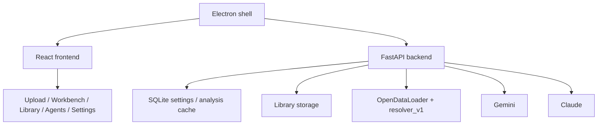

<div align="center">


# Sasoo

### 논문을 읽기 전에 구조를 세우고, 읽는 동안 figure를 해석하고, 읽은 뒤에는 재현 파라미터까지 남기는 AI 연구 워크벤치

<p>
  <a href="https://github.com/dosigner/sasoo/releases/tag/v0.6.6">
    
  </a>
  <a href="https://github.com/dosigner/sasoo/releases/latest">
    
  </a>
  
</p>

<p>
  
  
  
  
  
</p>

<p>
  <a href="https://github.com/dosigner/sasoo/releases/download/v0.6.6/Sasoo.Setup.0.6.6.exe">
    
  </a>
  <a href="https://github.com/dosigner/sasoo/releases/download/v0.6.6/Sasoo-0.6.6-arm64-mac.zip">
    
  </a>
</p>

<p>
  Sasoo는 PDF를 그냥 요약하지 않습니다.<br/>
  논문을 보관 가능한 단위로 정리하고, 도메인에 맞는 에이전트를 붙이고, figure/table과 recipe를 다시 꺼내 보기 쉬운 형태로 남깁니다.
</p>

</div>

<div align="center">
  
</div>

---

## Why Sasoo

<table>
<tr>
<td width="33%" valign="top">
<strong>Archive-first</strong><br/>
한 번 올린 논문은 끝나지 않습니다. PDF, figure, table, recipe, 질문 기록, 보고서가 모두 라이브러리에 남습니다.
</td>
<td width="33%" valign="top">
<strong>Figure-aware</strong><br/>
본문 요약만 하지 않고 figure/table 추출, caption 매칭, 시각 자료 품질 검토, 개별 figure 설명까지 이어집니다.
</td>
<td width="33%" valign="top">
<strong>Agent-routed</strong><br/>
광학, 바이오, 딥러닝, 회로 계열 에이전트와 커스텀 에이전트를 붙여 논문마다 다른 시선으로 읽게 합니다.
</td>
</tr>
</table>

## Current Release

`v0.6.6`은 지금 공개 배포 중인 최신 릴리즈입니다.

- Windows NSIS 인스톨러와 macOS Apple Silicon ZIP이 함께 배포됩니다.
- 데스크톱 설정 저장과 라이브러리 경로 처리 안정화가 반영됐습니다.
- `resolver_v1` 기반 figure/table 추출 경로가 기본값입니다.
- 릴리즈 빌드에서 Java 기반 OpenDataLoader 런타임을 함께 패키징합니다.
- Workbench, Library, Agents, Settings, Experiment Plan 흐름이 한 묶음으로 정리되어 있습니다.

## What You Get

| Surface | What it does |
| --- | --- |
| Upload | PDF 업로드, 파일 검증, 최근 분석/라이브러리 기록, 도메인 및 담당 에이전트 확인 |
| Workbench | PDF 뷰어와 분석 패널을 나란히 두고 요약, figure, table, recipe, experiment plan, chat을 함께 검토 |
| Library | 제목, 저자, DOI, 태그, 상태, 연도 기준으로 검색하고 다시 열기 |
| Agents | 기본 에이전트 외에 커스텀 `.md` 에이전트를 생성하고 수정 |
| Settings | Gemini/Anthropic 키, 라이브러리 경로, 자동 분석, 테마, 추출 파이프라인, 비용 대시보드 관리 |
| Reports | 분석 결과를 재현 가능한 markdown 리포트와 artifact 상태로 남김 |

## Domain Agents

| Agent | Focus |
| --- | --- |
| Photon | 광학, 레이저, FSO, 실험 셋업 검토 |
| Cell | 바이오, 분자생물학, 샘플 수와 실험 조건 점검 |
| Neural | 딥러닝, CV, NLP, ablation과 비교 실험 검토 |
| Circuit | 회로, 반도체, 신호처리, 조건과 FoM 정리 |
| Custom agents | 앱 안에서 생성한 `.md` 기반 도메인 프롬프트 |

## Workflow


```mermaid
flowchart LR
    A["PDF 업로드"] --> B["도메인 분류 + 에이전트 배정"]
    B --> C["텍스트/figure/table artifact 생성"]
    C --> D["4단계 분석 실행"]
    D --> E["Workbench 검토"]
    E --> F["Library 보관"]
    E --> G["Chat / Experiment Plan"]
```

### 4-Phase Analysis

1. `Screening`
   논문의 도메인, 핵심 주장, 실험성, relevance를 빠르게 거릅니다.
2. `Visual Verification`
   figure/table을 중심으로 축, 품질, caption 맥락, 시각 artifact 상태를 확인합니다.
3. `Recipe Extraction`
   방법론과 실험 파라미터를 구조화된 recipe 카드로 뽑습니다.
4. `Deep Dive`
   claim, evidence, weak point, follow-up 질문, Mermaid 기반 설명 흐름까지 확장합니다.

## Installation

| Platform | Asset | Notes |
| --- | --- | --- |
| Windows 10/11 | [`Sasoo.Setup.0.6.6.exe`](https://github.com/dosigner/sasoo/releases/download/v0.6.6/Sasoo.Setup.0.6.6.exe) | NSIS installer |
| macOS Apple Silicon | [`Sasoo-0.6.6-arm64-mac.zip`](https://github.com/dosigner/sasoo/releases/download/v0.6.6/Sasoo-0.6.6-arm64-mac.zip) | unsigned ZIP |
| Linux | source build | 현재 GitHub release asset은 제공하지 않음 |

### macOS note

macOS 배포본은 unsigned ZIP입니다.

1. ZIP을 풀고 `Sasoo.app`를 `/Applications`로 옮깁니다.
2. 실행이 막히면 아래를 실행합니다.

```bash
xattr -dr com.apple.quarantine /Applications/Sasoo.app
```

3. 그래도 경고가 뜨면 앱을 우클릭한 뒤 `Open`으로 1회 실행합니다.

## API Keys

전체 기능을 안정적으로 쓰려면 `Gemini`와 `Anthropic` 키를 둘 다 넣는 것이 좋습니다.

- Gemini: screening, visual 분석, 일부 resolver/visual generation 경로
- Anthropic: deep dive, Mermaid/diagram 생성, 일부 고급 분석 경로

설치 후 `Settings`에서 바로 입력할 수 있습니다.

## Quick Start

1. 앱을 설치하고 실행합니다.
2. `Settings`에서 API 키와 라이브러리 저장 경로를 확인합니다.
3. PDF를 업로드합니다.
4. 감지된 도메인과 에이전트를 확인한 뒤 Workbench로 진입합니다.
5. 분석을 시작하고 summary, figure, table, recipe를 순서대로 검토합니다.
6. 필요하면 chat과 experiment plan으로 후속 질문과 재현 계획을 만듭니다.

## Architecture


```mermaid
flowchart TB
    A["Electron shell"] --> B["React frontend"]
    A --> C["FastAPI backend"]
    C --> D["SQLite settings / analysis cache"]
    C --> E["Library storage"]
    C --> F["OpenDataLoader + resolver_v1"]
    C --> G["Gemini"]
    C --> H["Claude"]
    B --> I["Upload / Workbench / Library / Agents / Settings"]
```

### Main pieces

- Frontend: React 18 + TypeScript + Vite
- Desktop shell: Electron
- Backend API: FastAPI
- Persistence: SQLite + filesystem library storage
- Extraction: Java-based OpenDataLoader, resolver-based figure/table pipeline
- LLM layer: Gemini + Claude

## Local Development

저장소 루트에는 문서와 릴리즈 파일이 있고, 실제 앱 코드는 `sasoo/` 아래에 있습니다.

```bash
git clone https://github.com/dosigner/sasoo.git
cd sasoo/sasoo
pnpm install
python3 -m venv backend/.venv
source backend/.venv/bin/activate
pip install -r backend/requirements.txt pyinstaller
pnpm dev
```

### Useful commands

```bash
pnpm dev
pnpm build:mac:release
pnpm build:win:release
pnpm build:linux
```

### Release references

- GitHub Actions workflow: [`/.github/workflows/release.yml`](.github/workflows/release.yml)
- Release checklist: [`/sasoo/docs/03-release/release-checklist.md`](sasoo/docs/03-release/release-checklist.md)
- Electron build plan: [`/sasoo/docs/03-release/electron-build-plan.md`](sasoo/docs/03-release/electron-build-plan.md)

## Repository Map

```text
.
├── README.md
├── .github/workflows/release.yml
└── sasoo/
    ├── frontend/
    │   ├── src/pages/
    │   ├── src/components/
    │   └── src/lib/
    ├── backend/
    │   ├── api/
    │   ├── services/
    │   ├── models/
    │   └── agents/
    ├── electron/
    ├── scripts/
    └── docs/03-release/
```

## Notes For Reviewers

- 현재 공개 최신 릴리즈는 [`v0.6.6`](https://github.com/dosigner/sasoo/releases/tag/v0.6.6) 입니다.
- `latest.yml`과 `latest-mac.yml`이 함께 배포되므로 auto-update 메타데이터도 릴리즈 자산에 포함됩니다.
- 릴리즈 재태깅 상황에서는 GitHub 자동 changelog가 역방향 비교 링크를 만들 수 있으므로 본문을 수동 검토하는 편이 안전합니다.

## License

[MIT](LICENSE)
