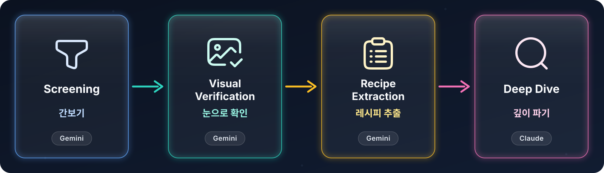
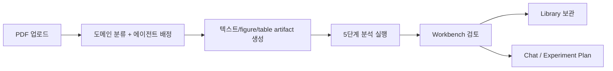
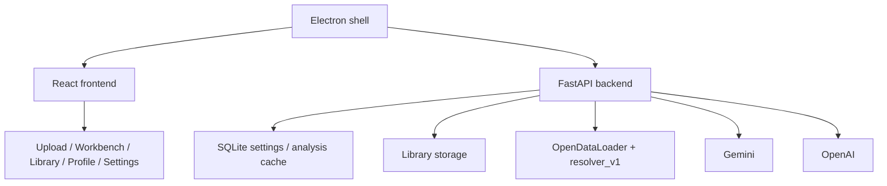

<div align="center">


# Sasoo

### 논문을 읽기 전에 구조를 세우고, 읽는 동안 figure를 해석하고, 읽은 뒤에는 재현 파라미터까지 남기는 AI 연구 워크벤치

<p>
  <a href="https://github.com/dosigner/sasoo/releases/tag/v0.6.7">
    
  </a>
  <a href="https://github.com/dosigner/sasoo/releases/latest">
    
  </a>
  
</p>

<p>
  
  
  
  
  
</p>

<p>
  <a href="https://github.com/dosigner/sasoo/releases">
    
  </a>
</p>

<p>
  Sasoo는 PDF를 그냥 요약하지 않습니다.<br/>
  논문을 보관 가능한 단위로 정리하고, 도메인에 맞는 에이전트를 붙이고, figure/table과 recipe를 다시 꺼내 보기 쉬운 형태로 남깁니다.
</p>

</div>

<div align="center">
  
</div>

<!-- README-I18N:START -->

**한국어** | [English](./README.en.md)

<!-- README-I18N:END -->

---

<div align="center">
  
  <p><sub>읽기 전 — 구조를 세우고 · 읽는 동안 — figure를 해석하고 · 읽은 뒤 — 재현 파라미터까지 남깁니다</sub></p>
</div>

## Why Sasoo

<table>
<tr>
<td width="33%" valign="top">
<strong>Archive-first</strong><br/>
한 번 올린 논문은 끝나지 않습니다. PDF, figure, table, recipe, 질문 기록, 보고서가 모두 라이브러리에 남습니다.
</td>
<td width="33%" valign="top">
<strong>Figure-aware</strong><br/>
본문 요약만 하지 않고 figure/table 추출, caption 매칭, 시각 자료 품질 검토, 개별 figure 설명까지 이어집니다.
</td>
<td width="33%" valign="top">
<strong>Agent-routed</strong><br/>
광학, 바이오, 딥러닝, 회로 계열 에이전트로 논문마다 다른 시선으로 읽고, 사용자 데이터 폴더에 `.md` 파일을 넣어 나만의 에이전트도 더할 수 있습니다.
</td>
</tr>
</table>

## Current Release

`v0.6.7` 실행 파일은 서명 상태 문제로 회수됐습니다. 다음 실행 파일은 새 버전으로 다시 배포합니다.

- 현재 v0.6.7 릴리즈에는 설치 가능한 실행 파일이 없습니다.
- 다음 macOS Apple Silicon 빌드는 미서명 ZIP으로 배포하며, 아래의 `xattr` 절차가 필요합니다.
- 데스크톱 설정 저장과 라이브러리 경로 처리 안정화가 반영됐습니다.
- `resolver_v1` 기반 figure/table 추출 경로가 기본값입니다.
- 릴리즈 빌드에서 Java 기반 OpenDataLoader 런타임을 함께 패키징합니다.
- Workbench, Library, 연구자 프로필, Settings, Experiment Plan 흐름이 한 묶음으로 정리되어 있습니다.

## What You Get

| Surface | What it does |
| --- | --- |
| Upload | PDF 업로드, 파일 검증, 최근 분석/라이브러리 기록, 도메인 및 담당 에이전트 확인 |
| Workbench | PDF 뷰어와 분석 패널을 나란히 두고 요약, figure, table, recipe, experiment plan, chat을 함께 검토 |
| Library | 제목, 저자, DOI, 태그, 상태, 연도 기준으로 검색하고 다시 열기 |
| Profile | 연구 배경과 기본 설명 수준을 관리하는 연구자 프로필 |
| Settings | Gemini/OpenAI 키, 라이브러리 경로, 자동 분석, 테마, 추출 파이프라인, 비용 대시보드 관리 |

## Domain Agents

| Agent | Focus |
| --- | --- |
| **Photon** | 광학, 레이저, FSO, 실험 셋업 검토 |
| **Cell** | 바이오, 분자생물학, 샘플 수와 실험 조건 점검 |
| **Neural** | 딥러닝, CV, NLP, ablation과 비교 실험 검토 |
| **Circuit** | 회로, 반도체, 신호처리, 조건과 FoM 정리 |
| **User overrides** | 사용자 데이터 폴더에 `.md` 파일을 직접 추가해 에이전트 확장 |

## Workflow


```mermaid
flowchart LR
    A["PDF 업로드"] --> B["도메인 분류 + 에이전트 배정"]
    B --> C["텍스트/figure/table artifact 생성"]
    C --> D["5단계 분석 실행"]
    D --> E["Workbench 검토"]
    E --> F["Library 보관"]
    E --> G["Chat / Experiment Plan"]
```

### 5-Phase Analysis

1. `Screening`
   논문의 도메인, 핵심 주장, 실험성, relevance를 빠르게 거릅니다.
2. `Citation Analysis`
   참고문헌을 정리하고 인용 빈도와 역할을 분석합니다.
3. `Visual Verification`
   figure/table을 중심으로 축, 품질, caption 맥락, 시각 artifact 상태를 확인합니다.
4. `Recipe Extraction`
   방법론과 실험 파라미터를 구조화된 recipe 카드로 뽑습니다.
5. `Deep Dive`
   claim, evidence, weak point, follow-up 질문, Mermaid 기반 설명 흐름까지 확장합니다.

## Installation

| Platform | Asset | Notes |
| --- | --- | --- |
| Windows 10/11 | [GitHub Releases](https://github.com/dosigner/sasoo/releases) | 새 버전 자산이 게시된 경우에만 제공 |
| macOS Apple Silicon | `Sasoo-<version>-arm64-mac.zip` | 공식 GitHub Release에서 제공하는 미서명 ZIP |
| Linux | source build | 현재 GitHub release asset은 제공하지 않음 |

### macOS note

macOS 배포본은 Apple Developer ID로 서명되거나 공증되지 않은 ZIP입니다. 따라서 Gatekeeper가 실행을 차단할 수 있으며, 아래 명령은 해당 앱의 quarantine 속성을 사용자가 직접 제거하는 우회 절차입니다.

1. 반드시 [`dosigner/sasoo` 공식 GitHub Releases](https://github.com/dosigner/sasoo/releases)에서 ZIP을 받습니다. 제3자가 다시 올린 파일에는 이 절차를 사용하지 마세요.
2. ZIP을 풀고 `Sasoo.app`를 `/Applications`로 옮깁니다.
3. 실행이 차단될 때만 Terminal에서 아래 명령을 실행합니다.

```bash
xattr -dr com.apple.quarantine /Applications/Sasoo.app
```

4. Finder에서 `Sasoo.app`를 우클릭하고 `Open`을 선택해 1회 실행합니다.

> [!WARNING]
> 이 명령은 Apple의 서명과 공증 검증을 통과시키는 것이 아니라 quarantine 보호를 제거합니다. 출처를 직접 확인한 공식 Sasoo 앱에만 사용하고, 다운로드한 ZIP이나 앱을 다른 경로에 둔 경우 명령의 경로를 정확히 확인하세요.

## API Keys

핵심 분석은 `Gemini` 키만으로 동작합니다. 기본 이미지 생성 경로가 OpenAI라서, 그대로 쓰려면 `OpenAI` 키도 넣는 것이 좋습니다.

- Gemini: screening, visual 분석, deep dive, Mermaid/diagram 생성 등 대부분의 텍스트·비전 분석
- OpenAI: figure/이미지 생성(기본 이미지 프로바이더 — `Settings`에서 이미지 생성을 Gemini로 바꾸면 OpenAI 키 없이도 동작)

설치 후 `Settings`에서 바로 입력할 수 있습니다.

API 키의 암호화 키는 기본적으로 macOS Keychain, Windows Credential Manager 등 OS 자격 증명 저장소에 보관됩니다. 이전 버전의 `.sasoo_key`로 암호화된 값은 첫 실행 때 OS 저장소로 마이그레이션된 뒤 해당 파일을 제거합니다.

## Quick Start

1. 앱을 설치하고 실행합니다.
2. `Settings`에서 API 키와 라이브러리 저장 경로를 확인합니다.
3. PDF를 업로드합니다.
4. 감지된 도메인과 에이전트를 확인한 뒤 Workbench로 진입합니다.
5. 분석을 시작하고 summary, figure, table, recipe를 순서대로 검토합니다.
6. 필요하면 chat과 experiment plan으로 후속 질문과 재현 계획을 만듭니다.

## Architecture


```mermaid
flowchart TB
    A["Electron shell"] --> B["React frontend"]
    A --> C["FastAPI backend"]
    C --> D["SQLite settings / analysis cache"]
    C --> E["Library storage"]
    C --> F["OpenDataLoader + resolver_v1"]
    C --> G["Gemini"]
    C --> H["OpenAI"]
    B --> I["Upload / Workbench / Library / Profile / Settings"]
```

### Main pieces

- Frontend: React 18 + TypeScript + Vite
- Desktop shell: Electron
- Backend API: FastAPI
- Persistence: SQLite + filesystem library storage
- Extraction: Java-based OpenDataLoader, resolver-based figure/table pipeline
- LLM layer: Gemini(텍스트·비전 분석) + OpenAI(이미지 생성)

## Local Development

저장소 루트에는 문서와 릴리즈 파일이 있고, 실제 앱 코드는 `sasoo/` 아래에 있습니다.

```bash
git clone https://github.com/dosigner/sasoo.git
cd sasoo/sasoo
pnpm install
python3 -m venv backend/.venv
source backend/.venv/bin/activate
pip install -r backend/requirements.txt pyinstaller
pnpm dev
```

### Useful commands

```bash
pnpm dev
pnpm build:mac:release
pnpm build:win:release
pnpm build:linux
```

### Release references

- GitHub Actions workflow: [`/.github/workflows/release.yml`](.github/workflows/release.yml)
- Release checklist: [`/sasoo/docs/03-release/release-checklist.md`](sasoo/docs/03-release/release-checklist.md)
- Electron build plan: [`/sasoo/docs/03-release/electron-build-plan.md`](sasoo/docs/03-release/electron-build-plan.md)

## Repository Map

```text
.
├── README.md
├── .github/workflows/release.yml
└── sasoo/
    ├── frontend/
    │   ├── src/pages/
    │   ├── src/components/
    │   └── src/lib/
    ├── backend/
    │   ├── api/
    │   ├── services/
    │   ├── models/
    │   └── agents/
    ├── electron/
    ├── scripts/
    └── docs/03-release/
```

## Notes For Reviewers

- [`v0.6.7`](https://github.com/dosigner/sasoo/releases/tag/v0.6.7) 실행 파일은 회수됐으며 새 버전 자산이 게시되기 전까지 직접 다운로드 링크를 제공하지 않습니다.
- macOS 공개 빌드는 현재 미서명 ZIP 정책이며 README의 제한된 `xattr` 설치 절차를 사용합니다.
- 릴리즈 재태깅 상황에서는 GitHub 자동 changelog가 역방향 비교 링크를 만들 수 있으므로 본문을 수동 검토하는 편이 안전합니다.

## License

[MIT](LICENSE)
